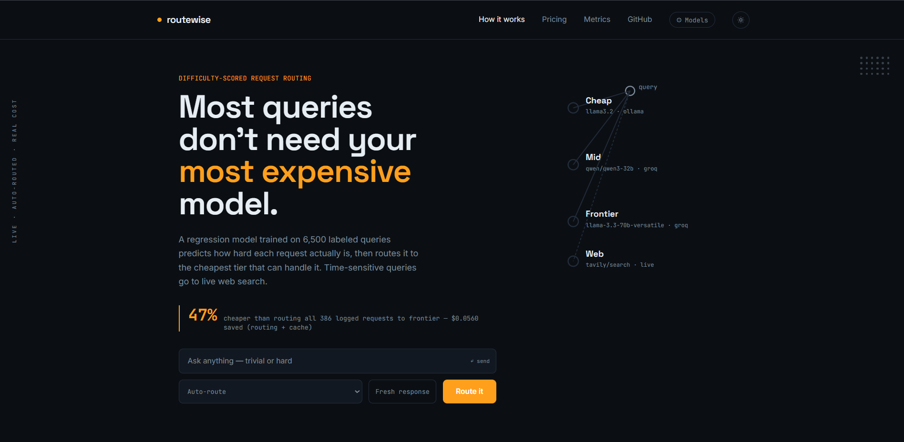
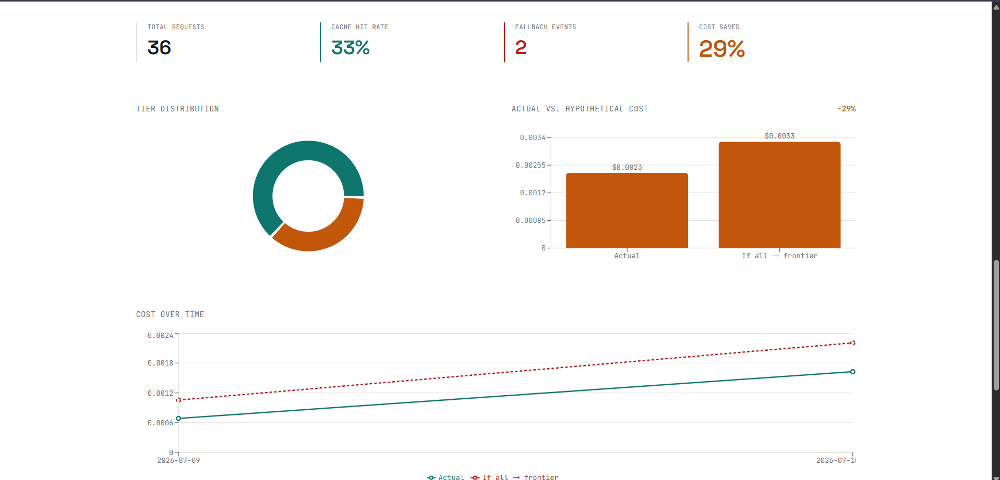
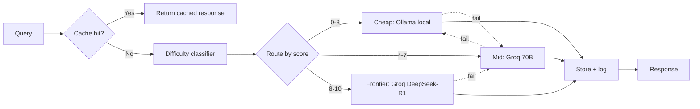

# routewise

**Cost-aware LLM request router.** Scores every query for difficulty, routes it to the cheapest model tier that can handle it, caches near-duplicates, and fails over gracefully when a provider errors or rate-limits.

[**Live demo**](https://llm-router-nine-eta.vercel.app/) · [**API**](https://llm-router-d2b2.onrender.com) · [**GitHub**](https://github.com/Ishan-5/llm-router)

    

---

### Contents
[The problem](#the-problem) · [Screenshots](#screenshots) · [How it works](#how-it-works) · [Architecture](#architecture) · [Tech stack](#tech-stack) · [Engineering decisions](#engineering-decisions) · [Known limitations](#known-limitations) · [Running it](#running-it-locally) · [Project structure](#project-structure) · [Roadmap](#roadmap)

---

## The problem

Sending every query — `"hi"`, a summarization job, a system-design question — to the same frontier-class model wastes money at scale. Most queries don't need it. This router sits between the caller and the LLM providers, scores how hard each request actually is, and picks the cheapest tier that can handle it.

## Screenshots


The right panel is a live circuit diagram of the three tiers — the active node lights up based on the real routing decision for whatever you type, not a static illustration.


Pulled from `/stats`, aggregating every request this instance has actually logged.

## How it works

1. **Score** — a LightGBM regressor, trained on 6,500 labeled queries, predicts a 0–10 difficulty score directly from query text. Runs locally in under 100ms, no API call required.
2. **Route** — the score maps to `cheap` / `mid` / `frontier`. A safety margin biases borderline queries toward the safer tier — under-routing a hard query to a weak model costs more than over-routing an easy one to a strong one.
3. **Respond** — a semantic cache checks for near-duplicate queries first. If the assigned tier's provider call fails or rate-limits, the request steps down to the next tier automatically instead of erroring out.

## Architecture



## Tech stack

| Layer | Tools |
|---|---|
| Difficulty model | LightGBM, sentence-transformers (MiniLM-L6-v2) |
| Backend | FastAPI, SQLAlchemy, Supabase (Postgres) |
| Providers | Groq (mid/frontier), Ollama (local cheap tier) |
| Frontend | React, Vite, Tailwind, Recharts |
| Deployment | Docker, Render (backend), Vercel (frontend) |

## Model tiers

| Tier | Model | Backend |
|---|---|---|
| Cheap | `llama3.2:3b` | Local via Ollama → falls back to Groq `llama-3.1-8b-instant` if unreachable |
| Mid | `llama-3.3-70b-versatile` | Groq |
| Frontier | `deepseek-r1-distill-llama-70b` | Groq |

## Engineering decisions

- **Continuous 0–10 score, not fixed categories.** Routing thresholds can be retuned later without relabeling any data.
- **Cache threshold is conservative (0.95 cosine similarity) on purpose.** Semantic similarity isn't correctness — *"convert 5 miles to km"* and *"convert 10 miles to km"* are ~95%+ similar in embedding space with different correct answers. Fewer cache hits beats a wrong cached answer.
- **Safety margin at the frontier boundary is asymmetric.** It only nudges borderline queries *up* toward the safer tier, never down — an easy query routed to a pricier tier costs money; a hard query routed to a weaker tier risks a bad answer.
- **Cheap-tier fallback lives inside the provider call, not the tier chain.** If Ollama fails, Groq serves the request instead — transparently, still logged as tier `cheap`.

## Known limitations

- **Ollama doesn't run in the cloud deployment.** Render has no local GPU, so every cheap-tier request there hits Ollama, fails, and falls back to Groq. Local demos are the only place the local-model path actually runs.
- **Failover is single-provider.** The chain moves between tiers within Groq (plus the Ollama→Groq fallback). No second independent provider is wired in, so a full Groq outage isn't covered.
- **The difficulty model is weaker on system-design/architecture queries** — the training data (general instruction-style queries) has very few real examples of that category.
- **Training labels have some noise.** Auto-labeled by an LLM, validated against a 210-row hand-labeled gold set, not fully human-audited. Current model: MAE 1.09, Spearman 0.74 on held-out data.
- **CORS is wide open (`allow_origins=["*"]`)** — fine for a public demo, not how this would ship for real traffic.

## Running it locally

```bash
git clone https://github.com/Ishan-5/llm-router.git
cd llm-router

# backend
pip install -r requirements.txt
uvicorn router.main:app --reload

# frontend, separate terminal
cd frontend
npm install
npm run dev
```

Needs a `.env` with `GROQ_API_KEY` and `DATABASE_URL` (Supabase Postgres connection string). Ollama is optional locally — if it's not running, the cheap tier falls back to Groq automatically.

## Running it with Docker

```bash
docker compose build
docker compose up
```

Ollama still runs natively on the host, not in the container — see `docker-compose.yml` for the `host.docker.internal` networking that lets the container reach it.

## Project structure

```
llm-router/
├── backend/
│   ├── router/                         # FastAPI backend
│   │   ├── main.py                     # /route and /stats endpoints
│   │   ├── classifier.py               # wraps the trained difficulty model
│   │   ├── providers.py                # Groq + Ollama calls, cost calculation
│   │   ├── rate_limiter.py             # tier-level failover
│   │   ├── cache.py                    # semantic cache
│   │   ├── config.py                   # model tiers, fallback chain, pricing
│   │   ├── db.py                       # request logging (Postgres via SQLAlchemy)
│   │   └── ollama_client.py            # Ollama HTTP client
│   ├── src/
│   │   ├── train_difficulty_model.py   # LightGBM training script
│   │   └── predict_difficulty.py       # inference + tier mapping
│   ├── dataset_pipeline/               # labeling scripts + labeled dataset
│   │   ├── labeling_dataset/
│   │   │   ├── label_gold_dataset.py
│   │   │   └── label_merged_dataset_full.py
│   │   └── datasets/
│   │       ├── labeled_dataset/
│   │       └── raw/
│   ├── eval/                           # dataset collection scripts
│   │   ├── get_datasets/
│   │   └── datasets/
│   └── models/
│       └── difficulty_regressor.joblib
├── frontend/                           # React + Vite + Tailwind + Recharts
│   ├── src/
│   │   ├── components/
│   │   │   ├── Header.jsx
│   │   │   ├── Footer.jsx
│   │   │   ├── RoutingDiagram.jsx
│   │   │   ├── MetricsDashboard.jsx
│   │   │   ├── HowItWorks.jsx
│   │   │   └── ThemeToggle.jsx
│   │   ├── App.jsx
│   │   ├── api.js
│   │   ├── main.jsx
│   │   ├── index.css
│   │   └── useTheme.js
│   ├── index.html
│   ├── package.json
│   ├── tailwind.config.js
│   └── vite.config.js
├── Dockerfile
├── docker-compose.yml
├── requirements.txt
└── .env.example

```

## Roadmap

No automated test suite, no CI pipeline, no multi-provider failover, no auth/rate-limiting for public API use. Next additions if this moves past portfolio scope.

*Built by [Ishan](https://github.com/Ishan-5) · [LinkedIn](https://linkedin.com/in/devansh584)*
