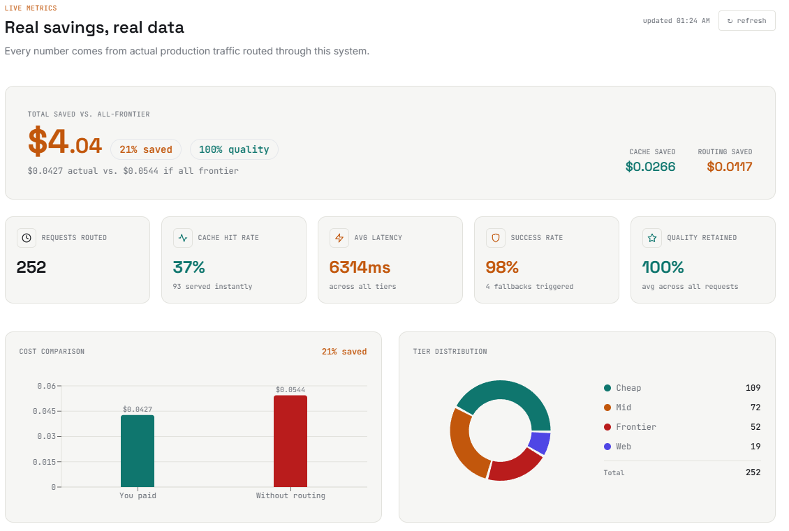
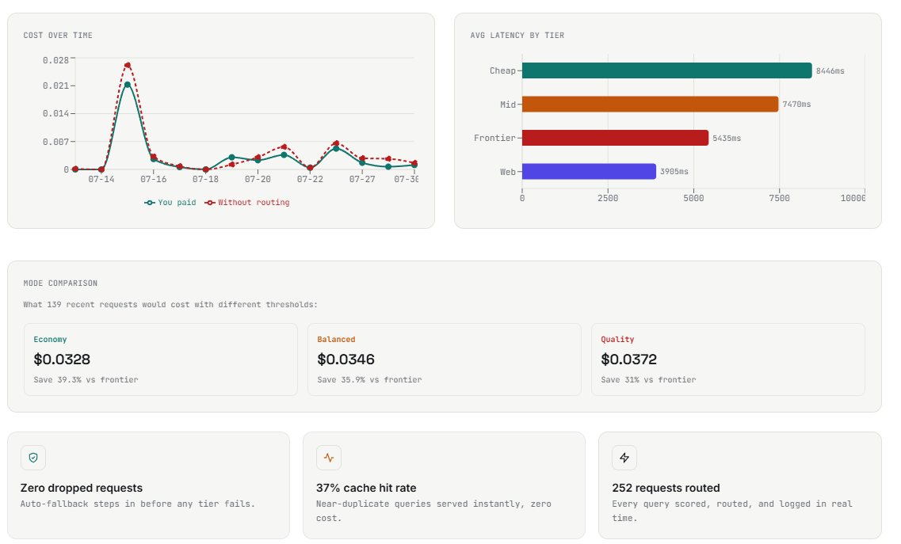
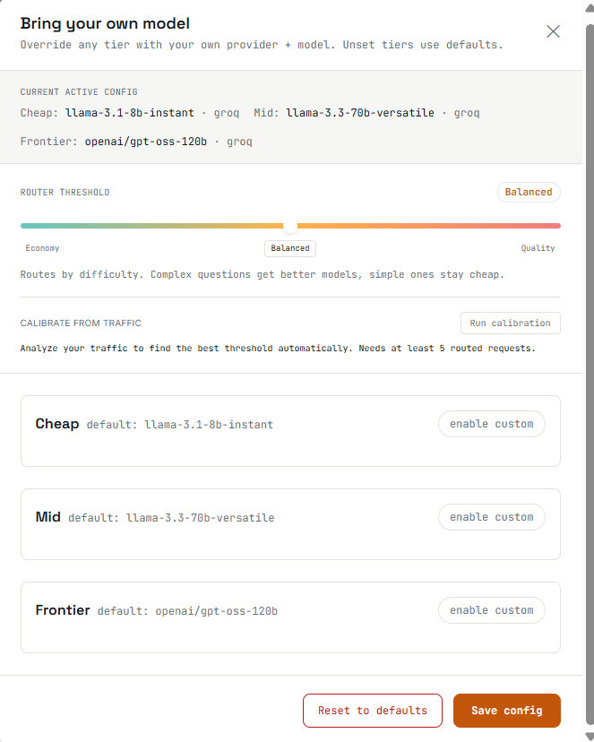
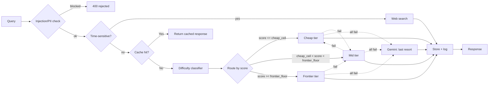
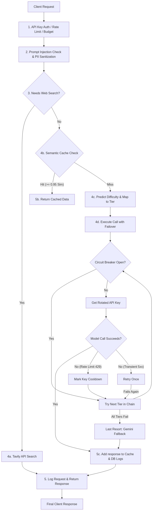

# routewise

**Cost-aware LLM request router.** Scores every query for difficulty, routes it to the cheapest model tier that can handle it, checks live web results for time-sensitive queries, caches near-duplicates, fails over across providers when one errors or rate-limits, screens for injection/PII before anything else runs, lets callers bring their own model keys, fires webhook alerts on cost/error/latency thresholds, and exposes an MCP gateway for agent tool use.

[**Live demo**](https://llm-router-nine-eta.vercel.app/) · [**PyPI SDK**](https://pypi.org/project/routewise/) · [**GitHub**](https://github.com/Ishan-5/llm-router)

     

---

### Contents
[The problem](#the-problem) · [Screenshots](#screenshots) · [How it works](#how-it-works) · [Architecture](#architecture) · [Tech stack](#tech-stack) · [Model tiers](#model-tiers) · [Security](#security) · [Engineering decisions](#engineering-decisions) · [Known limitations](#known-limitations) · [SDK](#sdk) · [MCP gateway](#mcp-gateway) · [Alerting](#alerting) · [Running it](#running-it-locally) · [Project structure](#project-structure) · [Roadmap](#roadmap)

---

## The problem

Sending every query — `"hi"`, a summarization job, a system-design question — to the same frontier-class model wastes money at scale. Most queries don't need it. This router sits between the caller and the LLM providers, scores how hard each request actually is, and picks the cheapest tier that can handle it.

## Screenshots


The right panel is a live circuit diagram of the tiers — the active node lights up based on the real routing decision for whatever you type, not a static illustration. Tick marks on the gauge show the actual `cheap_ceil` and `frontier_floor` thresholds in real time as the slider moves.



Pulled from `/stats`. **Note on this data:** it reflects test usage over several days while building and validating the system, including a seeding script whose second pass intentionally sent semantically similar queries to populate cache-hit metrics for demonstration — not an organic cache hit rate from real traffic. Stated here plainly rather than left ambiguous.


## How it works

1. **Guard** — every incoming query is checked for prompt-injection patterns and PII before anything else happens; flagged injection attempts are rejected with a 400, PII is sanitized before being logged.
2. **Search or Score** — time-sensitive queries (regex-detected: "today," "latest," "current," etc.) are routed to a live web search instead of an LLM. Everything else gets a difficulty score from a LightGBM regressor, trained on 6,500 labeled queries, running locally in under 100ms with no API call required.
3. **Route** — the score maps to `cheap` / `mid` / `frontier` using two thresholds (`cheap_ceil` and `frontier_floor`) that both shift with a user-controlled sensitivity slider (economy → balanced → quality). Both boundaries move — economy raises the cheap ceiling and frontier floor (more cheap, less frontier); quality lowers both (less cheap, more frontier).
4. **Respond** — a semantic cache checks for near-duplicate queries first. If the assigned tier's provider fails or rate-limits, the request steps down to the next tier automatically. If the *entire* tier chain fails (e.g. a full Groq outage), an independent second provider (Gemini) is tried as a last resort before giving up.

## Architecture



Thresholds are dynamic — `cheap_ceil` and `frontier_floor` shift with the sensitivity slider and are returned in every `/route` response so the frontend diagram can show live tick marks.

Rendered end-to-end flow (request → guardrails → scoring → routing → failover → response):



## Tech stack

| Layer | Tools |
|---|---|
| Difficulty model | LightGBM, sentence-transformers (MiniLM-L6-v2) |
| Backend | FastAPI, SQLAlchemy, Supabase (Postgres), MCP (agent gateway) |
| Providers | Groq, Gemini (cross-provider fallback), Ollama (local cheap tier), Tavily (web search), Anthropic, OpenAI, DeepSeek, Mistral, Perplexity, xAI — + user-supplied keys via BYOM |
| Load balancing | Round-robin across multiple API keys per tier, with per-key 429 cooldown |
| Frontend | React, Vite, Tailwind, Recharts |
| Deployment | Docker, Render (backend), Vercel (frontend), PyPI (SDK) |
| Testing | pytest (38 tests) |

## Model tiers

Default tiers if the caller doesn't configure their own (see [BYOM](#sdk)):

| Tier | Model | Backend |
|---|---|---|
| Cheap | Groq `llama-3.1-8b-instant` | Falls back from Ollama (local) if running locally with Ollama enabled |
| Mid | `llama-3.3-70b-versatile` | Groq |
| Frontier | `openai/gpt-oss-120b` | Groq |
| Web | live search results | Tavily, for time-sensitive queries only |

Last-resort fallback (all model tiers above failed): `gemini-1.5-flash` via Google — a genuinely independent provider, not just another Groq tier.

## Security

- **Prompt-injection detection** — incoming queries are checked against known injection patterns before classification; matches are rejected with a 400, not silently routed.
- **PII sanitization** — detected PII patterns are scrubbed before a query is written to logs.
- **API keys are never stored.** Bring-your-own-model configuration stores provider/model *selections*, not credentials — user-supplied API keys are used per-request and not persisted to the database.
- **Per-key auth, rate limiting, and budget caps** on all sensitive endpoints (`/route`, `/logs`), with logs correctly filtered to the calling key only.
- **SSRF-safe webhook validation** — alert webhook URLs are validated before saving: must be `https://`, non-localhost, non-private-IP range (blocks 10.x, 172.16.x, 192.168.x, 169.254.x, loopback, link-local).
- **CORS restricted** to the deployed frontend origin and localhost, not wildcard.

## Engineering decisions

- **Continuous score, not fixed categories.** The difficulty model outputs a float (practical range ~1.5–5.8 due to training data compression) theoretical range 0-10. Routing thresholds can be retuned without relabeling any data.
- **Both tier boundaries move with the slider.** `cheap_ceil` and `frontier_floor` both shift together — economy mode raises both (more cheap), quality mode lowers both (more frontier). The slider maps 0–2 to a scaled margin so the defaults at `balanced=1.0` stay sensible.
- **`score_to_tier` returns a tuple `(tier, cheap_ceil, frontier_floor)`.** The thresholds are returned alongside the tier so the `/route` response can include them and the frontend diagram can render live tick marks without a separate API call.
- **Cache threshold is conservative (0.95 cosine similarity) on purpose.** Semantic similarity isn't correctness — *"convert 5 miles to km"* and *"convert 10 miles to km"* are ~95%+ similar in embedding space with different correct answers. Fewer cache hits beats a wrong cached answer.
- **Cheap-tier fallback lives inside the provider call, not the tier chain.** If Ollama fails, Groq serves the request instead — transparently, still logged as tier `cheap`.
- **Gemini is a last resort, not a routing tier.** Only called if every Groq/Ollama option has already failed — chosen because it's genuinely different infrastructure, so a Groq-wide outage doesn't take the whole router down with it.
- **Cache similarity search is vectorized**, not a per-row Python loop — one matrix operation instead of N individual comparisons.
- **Multi-key load balancing uses per-key cooldown, not pool-level.** When a key gets a 429, only that key is skipped for 30 seconds — other keys in the pool keep serving. Round-robin resumes automatically after cooldown.
- **Alert cooldown is per-rule, not global.** Each alert rule tracks its own `last_fired_at` — a cost alert and a latency alert for the same user fire independently.

## Known limitations

- **Ollama doesn't run in the cloud deployment.** Render has no local GPU, so every cheap-tier request there hits Ollama, fails, and falls back to Groq. Local demos are the only place the local-model path actually runs.
- **Dashboard data is seeded** — see the disclosure under [Screenshots](#screenshots).
- **BYOM configuration is scoped per user, not per-API-key.** Config is loaded per user (`get_active_config(user_id)`), so each signed-in user's model choices are isolated from others — but two API keys belonging to the same user share that user's config, and script-created keys without a `user_id` share the default/global config. A fully per-key version would scope this at the `api_keys` row level.
- **The difficulty model is weaker on system-design/architecture queries** — the training data has very few real examples of that category.
- **Training labels have some noise.** Auto-labeled by an LLM, validated against a 210-row hand-labeled gold set, not fully human-audited. Current model: MAE 1.09, Spearman 0.74 on held-out data.
- **Injection/PII detection is regex-based**, not a trained classifier — catches known patterns, not a guarantee against novel attacks.
- **Rate limiting is in-memory** — correct for a single server instance, would need Redis for a distributed deployment.
- **Alert cooldown is DB-backed, but the check loop runs per-process.** `last_fired_at` is read from and written back to the DB on every loop iteration, so a fired alert won't re-fire for an hour even across instances — except for a small race window if two processes check the same rule before either commits. Not a concern for a single instance.
- **MCP server has no auth.** It's a local stdio process — the assumption is it runs on the developer's machine. Don't expose it as a network service without adding auth.

## SDK

Published on PyPI:
```bash
pip install routewise
```
```python
from routewise import RouteWiseClient

client = RouteWiseClient(api_key="rw_your_key")
result = client.ask("What is the capital of France?")
print(result["response"], result["cost_usd"])

# Bring your own model (per tier)
client.configure(
    cheap={"provider": "groq", "model_id": "llama-3.1-8b-instant", "api_key": "gsk_..."},
    frontier={"provider": "anthropic", "model_id": "claude-3-5-sonnet-20241022", "api_key": "sk-ant-..."},
)
```

## MCP gateway

Routewise ships an MCP server (`router/mcp_server.py`) that exposes the full routing pipeline as a tool agents can call directly — no HTTP round-trip to the FastAPI server.

```bash
pip install mcp
cd llm-router/backend
python -m router.mcp_server
```

**Claude Desktop** (`~/.claude/claude_desktop_config.json`):
```json
{
  "mcpServers": {
    "routewise": {
      "command": "python",
      "args": ["-m", "router.mcp_server"],
      "cwd": "/path/to/llm-router/backend"
    }
  }
}
```

The tool is `ask_routewise(query, override_tier?, threshold?)`. It runs guardrails → web search → cache → classifier → failover chain, same as `/route`. Responses are prefixed with routing metadata: `[cheap score=2.31 $0.00001]`.

## Alerting

Set webhook alerts on cost, error rate, or latency thresholds via the dashboard or API. Alerts fire at most once per hour per rule.

```bash
# Create an alert
curl -X POST https://your-backend/alerts \
  -H "Authorization: Bearer <supabase-jwt>" \
  -d '{"alert_type": "daily_spend", "threshold": 0.10, "webhook_url": "https://hooks.example.com/..."}'

# Alert types:
# daily_spend  — threshold in USD (fires when today's spend >= threshold)
# error_rate   — threshold in % (fires when failed requests in last hour >= threshold%)
# latency      — threshold in ms (fires when avg latency in last hour >= threshold ms)
```

Webhook payload:
```json
{
  "alert_type": "daily_spend",
  "threshold": 0.10,
  "current_value": 0.143,
  "message": "Daily spend $0.1430 exceeded threshold $0.1000"
}
```

## Running it locally

```bash
git clone https://github.com/Ishan-5/llm-router.git
cd llm-router/backend

pip install -r ../requirements.txt
uvicorn router.main:app --reload

# frontend, separate terminal
cd ../frontend
npm install
npm run dev
```

Needs a `.env` with `GROQ_API_KEY`, `GEMINI_API_KEY`, `TAVILY_API_KEY`, `DATABASE_URL` (Supabase Postgres), `SUPABASE_URL`, and `SUPABASE_SERVICE_KEY`. Ollama is optional locally — if it's not running, the cheap tier falls back to Groq automatically.

Optional multi-key load balancing:
```bash
GROQ_KEYS_CHEAP=gsk_a,gsk_b,gsk_c
GROQ_KEYS_MID=gsk_d,gsk_e
GROQ_KEYS_FRONTIER=gsk_f,gsk_g
```

## Running it with Docker

```bash
docker compose build
docker compose up
```

Ollama still runs natively on the host, not in the container — see `docker-compose.yml` for the `host.docker.internal` networking that lets the container reach it.

## Project structure

```
llm-router/
├── backend/
│   ├── router/
│   │   ├── main.py               # FastAPI app, mounts all routers, alert loop, /health, /metrics
│   │   ├── routes/
│   │   │   ├── route.py          # /route, /route/stream
│   │   │   ├── keys.py           # /keys CRUD
│   │   │   ├── config.py         # /config, /pricing, /providers
│   │   │   ├── stats.py          # /stats, /logs, /analytics, /calibrate, /compare, /evaluate
│   │   │   ├── alerts.py         # /alerts CRUD
│   │   │   ├── settings.py       # /settings
│   │   │   └── admin.py          # /admin/*
│   │   ├── classifier.py         # get_tier() — wraps predict_difficulty + score_to_tier
│   │   ├── providers.py          # call_model(), call_gemini(), stream_model()
│   │   ├── providers_registry.py # all supported providers + model lists
│   │   ├── rate_limiter.py       # call_with_failover(), AllTiersFailedError
│   │   ├── circuit_breaker.py    # per-tier circuit breaker (CLOSED/OPEN/HALF)
│   │   ├── load_balancer.py      # multi-key round-robin with 429 cooldown
│   │   ├── cache.py              # semantic cache (cosine similarity, vectorized)
│   │   ├── guardrails.py         # injection detection, PII sanitization, web search detection
│   │   ├── auth.py               # API key auth, JWT, budget enforcement
│   │   ├── db.py                 # SQLAlchemy models: ApiKey, RequestLog, UserConfig, AlertRule, ...
│   │   ├── openai_compat.py      # /v1/chat/completions drop-in endpoint
│   │   ├── mcp_server.py         # MCP stdio server — ask_routewise tool
│   │   ├── model_config_loader.py
│   │   ├── ollama_client.py
│   │   └── config.py             # MODEL_CONFIG, FALLBACK_CHAIN, env vars
│   ├── src/
│   │   ├── predict_difficulty.py # LightGBM inference + score_to_tier()
│   │   └── train_difficulty_model.py
│   ├── models/
│   │   ├── difficulty_regressor.joblib
│   │   └── minilm/               # MiniLM-L6-v2 weights (local, no download at runtime)
│   ├── tests/
│   │   ├── test_tier_logic.py
│   │   ├── test_cache_similarity.py
│   │   ├── test_auth.py
│   │   ├── test_rate_limiter.py
│   │   ├── test_route_integration.py
│   │   └── test_openai_compat.py
│   ├── scripts/
│   │   ├── create_api_key.py
│   │   └── seed_pricing.sql
│   └── eval/                     # training datasets
│
├── frontend/
│   ├── src/
│   │   ├── components/           # QueryForm, RoutingDiagram, TierCircuit, DashboardPage, ...
│   │   ├── api.js
│   │   ├── App.jsx
│   │   └── config.js
│   ├── package.json
│   └── vite.config.js
│
├── sdk/
│   └── routewise/                # PyPI package
│
├── .github/workflows/ci.yml
├── docker-compose.yml
├── Dockerfile
└── requirements.txt
```

## Roadmap

- No true PII/injection ML classifier (regex-only today)
- No per-key BYOM isolation (config is currently per-user, not key-scoped)
- No distributed rate limiting (in-memory only — needs Redis for multi-instance)
- MCP server has no auth (fine for local use, not for network exposure)

Not needed to call the current version complete — documented here for transparency.

---

*Built by [Devansh Kumar Pandey(Ishan)](https://github.com/Ishan-5) · [LinkedIn](https://linkedin.com/in/devansh584)*
