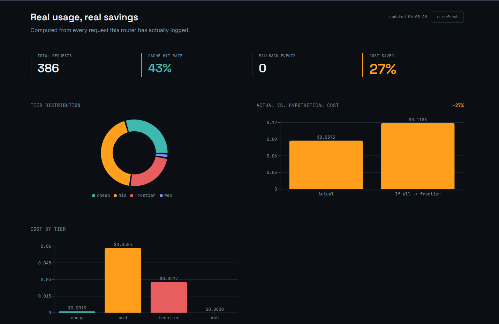
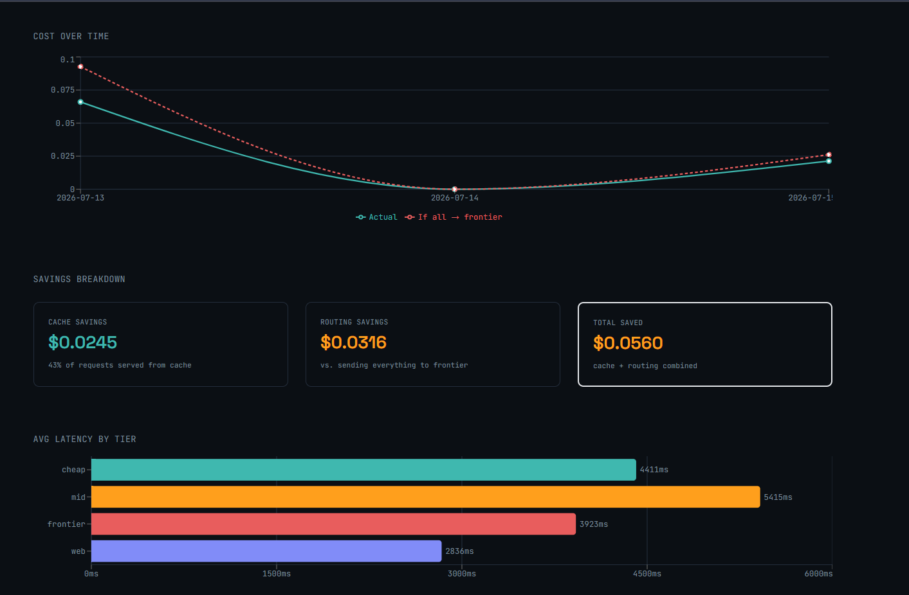
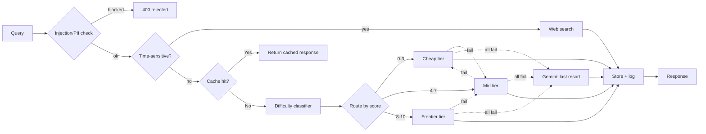

# routewise

**Cost-aware LLM request router.** Scores every query for difficulty, routes it to the cheapest model tier that can handle it, checks live web results for time-sensitive queries, caches near-duplicates, fails over across providers when one errors or rate-limits, screens for injection/PII before anything else runs, and lets callers bring their own model keys.

[**Live demo**](https://llm-router-nine-eta.vercel.app/) · · [**PyPI SDK**](https://pypi.org/project/routewise/) · [**GitHub**](https://github.com/Ishan-5/llm-router)

     

---

### Contents
[The problem](#the-problem) · [Screenshots](#screenshots) · [How it works](#how-it-works) · [Architecture](#architecture) · [Tech stack](#tech-stack) · [Model tiers](#model-tiers) · [Security](#security) · [Engineering decisions](#engineering-decisions) · [Known limitations](#known-limitations) · [SDK](#sdk) · [Running it](#running-it-locally) · [Project structure](#project-structure) · [Roadmap](#roadmap)

---

## The problem

Sending every query — `"hi"`, a summarization job, a system-design question — to the same frontier-class model wastes money at scale. Most queries don't need it. This router sits between the caller and the LLM providers, scores how hard each request actually is, and picks the cheapest tier that can handle it.

## Screenshots


The right panel is a live circuit diagram of the tiers — the active node lights up based on the real routing decision for whatever you type, not a static illustration.



Pulled from `/stats`. **Note on this data:** it reflects test usage over several days while building and validating the system, including a seeding script whose second pass intentionally sent semantically similar queries to populate cache-hit metrics for demonstration — not an organic cache hit rate from real traffic. Stated here plainly rather than left ambiguous.

## How it works

1. **Guard** — every incoming query is checked for prompt-injection patterns and PII before anything else happens; flagged injection attempts are rejected with a 400, PII is sanitized before being logged.
2. **Search or Score** — time-sensitive queries (regex-detected: "today," "latest," "current," etc.) are routed to a live web search instead of an LLM. Everything else gets a 0–10 difficulty score from a LightGBM regressor, trained on 6,500 labeled queries, running locally in under 100ms with no API call required.
3. **Route** — the score maps to `cheap` / `mid` / `frontier`. A safety margin biases borderline queries toward the safer tier — under-routing a hard query to a weak model costs more than over-routing an easy one to a strong one.
4. **Respond** — a semantic cache checks for near-duplicate queries first. If the assigned tier's provider fails or rate-limits, the request steps down to the next tier automatically. If the *entire* tier chain fails (e.g. a full Groq outage), an independent second provider (Gemini) is tried as a last resort before giving up.

## Architecture



## Tech stack

| Layer | Tools |
|---|---|
| Difficulty model | LightGBM, sentence-transformers (MiniLM-L6-v2) |
| Backend | FastAPI, SQLAlchemy, Supabase (Postgres) |
| Providers | Groq, Gemini (cross-provider fallback), Ollama (local cheap tier), Tavily (web search), + user-supplied keys via BYOM |
| Frontend | React, Vite, Tailwind, Recharts |
| Deployment | Docker, Render (backend), Vercel (frontend), PyPI (SDK) |
| Testing | pytest (22 tests), GitHub Actions CI |

## Model tiers

Default tiers if the caller doesn't configure their own (see [BYOM](#sdk)):

| Tier | Model | Backend |
|---|---|---|
| Cheap | `llama3.2:3b` | Local via Ollama → falls back to Groq `llama-3.1-8b-instant` if unreachable |
| Mid | `llama-3.3-70b-versatile` | Groq |
| Frontier | `qwen/qwen3-32b` | Groq |
| Web | live search results | Tavily, for time-sensitive queries only |

Last-resort fallback (all model tiers above failed): `gemini-1.5-flash` via Google — a genuinely independent provider, not just another Groq tier.

## Security

- **Prompt-injection detection** — incoming queries are checked against known injection patterns before classification; matches are rejected with a 400, not silently routed.
- **PII sanitization** — detected PII patterns are scrubbed before a query is written to logs.
- **API keys are never stored.** Bring-your-own-model configuration stores provider/model *selections*, not credentials — user-supplied API keys are used per-request and not persisted to the database.
- **Per-key auth, rate limiting, and budget caps** on all sensitive endpoints (`/route`, `/logs`), with logs correctly filtered to the calling key only.
- **CORS restricted** to the deployed frontend origin and localhost, not wildcard.

## Engineering decisions

- **Continuous 0–10 score, not fixed categories.** Routing thresholds can be retuned later without relabeling any data.
- **Cache threshold is conservative (0.95 cosine similarity) on purpose.** Semantic similarity isn't correctness — *"convert 5 miles to km"* and *"convert 10 miles to km"* are ~95%+ similar in embedding space with different correct answers. Fewer cache hits beats a wrong cached answer.
- **Safety margin at the frontier boundary is asymmetric.** It only nudges borderline queries *up* toward the safer tier, never down.
- **Cheap-tier fallback lives inside the provider call, not the tier chain.** If Ollama fails, Groq serves the request instead — transparently, still logged as tier `cheap`.
- **Gemini is a last resort, not a routing tier.** Only called if every Groq/Ollama option has already failed — chosen because it's genuinely different infrastructure, so a Groq-wide outage doesn't take the whole router down with it.
- **Cache similarity search is vectorized**, not a per-row Python loop — one matrix operation instead of N individual comparisons.

## Known limitations

- **Ollama doesn't run in the cloud deployment.** Render has no local GPU, so every cheap-tier request there hits Ollama, fails, and falls back to Groq. Local demos are the only place the local-model path actually runs.
- **Dashboard data is seeded** — see the disclosure under [Screenshots](#screenshots).
- **BYOM configuration is currently global, not per-API-key.** One caller's model configuration currently affects all callers — a real multi-tenant version would scope this per key. Documented here rather than silently left as a surprise.
- **`/route/stream` is a live but unused endpoint.** Streaming support exists and works at the API level; the frontend doesn't call it. Not a bug, just worth knowing it's reachable if you hit the API directly.
- **The difficulty model is weaker on system-design/architecture queries** — the training data has very few real examples of that category.
- **Training labels have some noise.** Auto-labeled by an LLM, validated against a 210-row hand-labeled gold set, not fully human-audited. Current model: MAE 1.09, Spearman 0.74 on held-out data.
- **Injection/PII detection is regex-based**, not a trained classifier — catches known patterns, not a guarantee against novel attacks.
- **Rate limiting is in-memory** — correct for a single server instance, would need Redis for a distributed deployment.

## SDK

Published on PyPI:
```bash
pip install routewise
```
```python
from routewise import RouteWiseClient

client = RouteWiseClient(api_key="rw_your_key")
result = client.ask("What is the capital of France?")
print(result["response"], result["cost_usd"])

# Bring your own model
client.configure(provider="openai", model="gpt-4o-mini", api_key="sk-...")
```

## Running it locally

```bash
git clone https://github.com/yourusername/llm-router.git
cd llm-router/backend

pip install -r requirements.txt
uvicorn router.main:app --reload

# frontend, separate terminal
cd ../frontend
npm install
npm run dev
```

Needs a `.env` with `GROQ_API_KEY`, `GEMINI_API_KEY`, `TAVILY_API_KEY`, and `DATABASE_URL` (Supabase Postgres). Ollama is optional locally — if it's not running, the cheap tier falls back to Groq automatically.

## Running it with Docker

```bash
docker compose build
docker compose up
```

Ollama still runs natively on the host, not in the container — see `docker-compose.yml` for the `host.docker.internal` networking that lets the container reach it.

## Project structure

```
llm-router/
├── backend/
│   ├── app/
│   │   ├── api/
│   │   ├── core/
│   │   ├── models/
│   │   ├── router/
│   │   ├── services/
│   │   ├── utils/
│   │   └── main.py
│   ├── tests/
│   ├── requirements.txt
│   └── .env.example
│
├── frontend/
│   ├── public/
│   ├── src/
│   │   ├── components/
│   │   ├── pages/
│   │   ├── hooks/
│   │   ├── services/
│   │   ├── utils/
│   │   ├── assets/
│   │   ├── App.jsx
│   │   └── main.jsx
│   ├── package.json
│   └── vite.config.js
│
├── datasets/
│   ├── raw/
│   ├── processed/
│   ├── evaluation/
│   └── benchmarks/
│
├── scripts/
│   ├── data_collection/
│   ├── preprocessing/
│   ├── evaluation/
│   └── benchmarking/
│
├── docs/
│   ├── architecture.md
│   ├── api.md
│   └── screenshots/
│
├── .github/
│   └── workflows/
│
├── .env.example
├── .gitignore
├── docker-compose.yml
├── Dockerfile
├── LICENSE
├── README.md
└── requirements.txt
```

## Roadmap

No true PII/injection ML classifier (regex-only today). No per-key BYOM isolation. No distributed rate limiting. Next additions if this moves past portfolio scope — not needed to call the current version complete.

```
*Built by [Ishan](https://github.com/Ishan-5) · [LinkedIn](https://linkedin.com/in/devansh584)*
