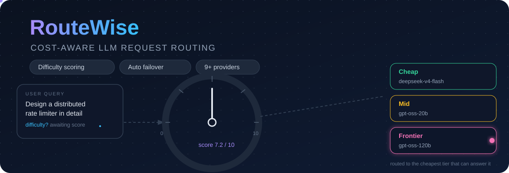
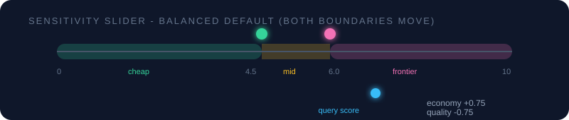
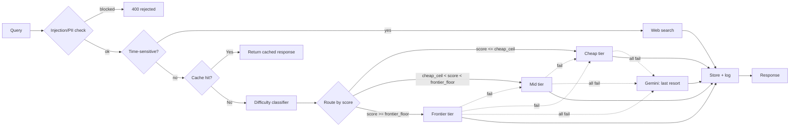

<p align="center">
  <a href="https://llm-router-nine-eta.vercel.app/"></a>
  <a href="https://pypi.org/project/routewise/"></a>
  <a href="https://github.com/Ishan-5/llm-router"></a>
</p>

<h1 align="center">⚡ RouteWise</h1>

<h3 align="center"><b>The cost-aware LLM request router.</b></h3>

<p align="center">
  Every query gets a <b>difficulty score</b> — then routed to the <b>cheapest model tier that can handle it</b>.<br/>
  Stop paying frontier-model prices for queries that a small model can answer perfectly.
</p>

<p align="center">
  
  
  
  
  
  
  
  
  
  <a href="https://llm-router-d2b2.onrender.com/health"></a>
</p>

<div align="center">

| 💸 **~56% cheaper** | 🎯 **77.5%** tier accuracy | ⚡ **<20 ms** per query | 🧠 **8,200** gold labels | 🔌 **9+** providers |
|---|---|---|---|---|
| than frontier-only routing | on held-out Claude-gold | local scoring, no API call | Claude-verified training set | with cross-provider failover |

</div>



> [!TIP]
> This banner is **live** — watch the gauge needle sweep, the packet fly, and the frontier
> node pulse. Repo READMEs support animated SVGs like this; see `screenshots/routewise-hero.svg`.

---

## 🚀 Quick start

<kbd>pip install routewise</kbd>

```bash
pip install routewise
```

```python
from routewise import RouteWiseClient

client = RouteWiseClient(api_key="rw_your_key")

# One call: scored, routed, cached, logged, billed — automatically.
result = client.ask("What is the capital of France?")
print(result["response"])     # the LLM answer
print(result["routed_to"])    # which tier handled it
print(result["cost_usd"])     # what it cost
```

> [!TIP]
> No config needed. RouteWise scores the difficulty of every query, picks the cheapest tier
> that can answer it, caches near-duplicates, and fails over across providers — out of the box.

---

## ✨ Why RouteWise?

Sending every query — `"hi"`, a summarization job, a system-design question — to the same
frontier-class model wastes money at scale. **Most queries don't need it.**

RouteWise sits between you and the LLM providers. It scores how hard each request actually is,
picks the cheapest tier that can handle it, and degrades gracefully when providers fail. You
get frontier-class quality where it matters — and **8B-model prices everywhere else**.

### RouteWise vs. calling providers directly

| | ❌ Calling a provider directly | ⚡ RouteWise |
|---|---|---|
| Difficulty-based routing | Always the same model | **Auto — cheap/mid/frontier by score** |
| Provider outage | Manual switching | **Auto failover + Gemini last resort** |
| Repeat queries | Billed every time | **Semantic cache → $0.00** |
| Prompt injection / PII | Your problem | **Screened before anything runs** |
| Cost tracking | Spreadsheets | **Per-request logs + dashboards + alerts** |
| Bring your own models | n/a | **Per-request `byom_config`** |
| Web search for time-sensitive queries | Manual | **Automatic Tavily routing** |
| OpenAI-compatible API | Native | **Drop-in `/v1/chat/completions`** |

> [!IMPORTANT]
> The average query costs **$0.000144** with RouteWise vs **$0.00033** if you send everything
> to the frontier model — **~56% cheaper**, before cache hits (which are free) are even counted.

---

## ✨ Features

| | | |
|---|---|---|
| 🎯 **Difficulty scoring** | 🧠 **Claude-gold trained** | 💰 **Real cost savings** |
| LightGBM ensemble scores every query 0–10 in <20 ms — locally, no API call just to decide routing | Trained on 8,200 Claude-verified labels (8,783-row gold dataset) · 77.5% exact-tier accuracy | ~56% cheaper than frontier-only; cached answers cost **$0.00** |
| 🛡️ **Guardrails first** | 🔄 **Cross-provider failover** | ⚖️ **Multi-key load balancing** |
| Prompt-injection detection + PII sanitization before anything else runs | frontier → mid → cheap → **Gemini last resort** — an outage never 503s you | Round-robin across keys per tier, per-key 429 cooldown |
| 🔌 **Bring your own model** | 🔍 **Live web search** | ⚡ **Semantic cache** |
| Any tier → any provider, incl. custom model IDs | Time-sensitive queries ("today", "latest"…) → live Tavily results | 0.95-cosine near-duplicate detection → instant, free repeats |
| 🎚️ **Sensitivity slider** | 🤖 **MCP gateway** | 🔔 **Webhook alerts** |
| Economy → Balanced → Quality moves both tier boundaries live | Agents call the full routing pipeline as a tool — no HTTP round-trip | Cost / error-rate / latency thresholds → SSRF-safe webhooks |
| 📊 **Live dashboard** | 👍 **Feedback loop** | 🧪 **OpenAI-compatible** |
| Real-time tier diagram, cost, latency, tier distribution | Thumbs up/down on every answer feeds active learning | Drop-in `/v1/chat/completions` endpoint |

---

## 🔄 How it works

| Step | What happens |
|---|---|
| **1 · Guard** 🛡️ | Every query is checked for **prompt-injection patterns** and **PII** before anything else. Flagged injections → `400` rejected. PII scrubbed before logging. |
| **2 · Search or Score** 🔎 | Time-sensitive queries (regex-detected: "today," "latest," "current,"…) → **live web search**. Everything else → difficulty score from a **LightGBM ensemble** (8,200 Claude-gold labels, <20 ms, no API call). |
| **3 · Route** 🎯 | Score maps to `cheap` / `mid` / `frontier` via two dynamic thresholds. A user slider moves **both** boundaries — economy sends more to cheap, quality sends more to frontier. |
| **4 · Respond** 💬 | **Semantic cache** catches near-duplicates first. If the assigned tier fails or rate-limits → step down automatically. Entire chain down → **Gemini answers as last resort**. |

### Threshold slider

| Mode | Cheap ceiling | Frontier floor | Behavior |
|---|---|---|---|
| 🪙 Economy | ≤ 5.25 | ≥ 6.75 | Max cheap, min frontier spend |
| ⚖️ Balanced | ≤ 4.5 | ≥ 6.0 | Default |
| 💎 Quality | ≤ 3.75 | ≥ 5.25 | Max frontier quality |



---

## 🏗️ Architecture



Thresholds are dynamic — `cheap_ceil` and `frontier_floor` shift with the sensitivity slider
and are returned in every `/route` response so the frontend diagram can show live tick marks.


---

## 🧰 Tech stack

| Layer | Tools |
|---|---|
| 🧠 Difficulty model | LightGBM · sentence-transformers (MiniLM-L6-v2) |
| ⚙️ Backend | FastAPI · SQLAlchemy · Supabase Postgres · MCP gateway |
| 🔌 Providers | Groq · Gemini · Ollama · Tavily · Anthropic · OpenAI · DeepSeek · Mistral · Perplexity · xAI |
| ⚖️ Load balancing | Round-robin across multiple keys per tier · per-key 429 cooldown |
| 🎨 Frontend | React · Vite · Tailwind · Recharts |
| 🚢 Deployment | Docker · Render (backend) · Vercel (frontend) · PyPI (SDK) |
| ✅ Testing | pytest (38 tests) · GitHub Actions CI |

---

## 🎛️ Model tiers

| Tier | Model | $ / 1M input | $ / 1M output | Backend |
|---|---|---|---|---|
| 🪙 Cheap | Groq `llama-3.1-8b-instant` | $0.05 | $0.08 | Groq (falls back to local Ollama) |
| ⚖️ Mid | `openai/gpt-oss-20b` | $0.075 | $0.30 | Groq |
| 💎 Frontier | `openai/gpt-oss-120b` | $0.15 | $0.60 | Groq |
| 🔎 Web | live search results | — | — | Tavily (time-sensitive only) |

**Last-resort fallback:** `gemini-1.5-flash` via Google — a genuinely independent provider, not
just another Groq tier.

---

## 💰 The cost math

~1,000 input + ~300 output tokens per query, balanced sensitivity:

| | Frontier-only baseline | RouteWise routed |
|---|---|---|
| Cheap share (~50%) | — | 8B @ $0.05/$0.08 → **$0.000074** |
| Mid share (~35%) | — | 20B @ $0.075/$0.30 → **$0.000165** |
| Frontier share (~15%) | gpt-oss-120b → **$0.00033** | gpt-oss-120b → **$0.00033** |
| **1,000 queries** | **$0.330** | **$0.144** |

> [!NOTE]
> **≈ 56% cheaper** than sending everything to the frontier model. Semantic-cache hits (~34% of
> measured traffic) add savings on top — cached answers cost **$0** in tokens.

---

## 📊 Measured results

Snapshot from the live deployment (`GET /stats`) — real routed traffic, not a synthetic
benchmark:

| Metric | Value |
|---|---|
| Requests routed | ~310 |
| Tier split | 44% cheap · 26% mid · 19% frontier · 9% web · 2% failed |
| Semantic cache hit rate | 34% |
| Total cost of the traffic shown | ~$0.05 |

The tier distribution shows the router doing what it's built for — the majority of real queries
are easy enough for the cheap 8B model, and only the genuinely hard ones reach the frontier
tier. *(Data reflects test usage accumulated while building the system — disclosed in full
under [Screenshots](#screenshots).)*

---

## 🎯 Model accuracy

Head-to-head on the **same 783 held-out Claude-gold rows** (queries neither model ever trained
on), each model at its balanced slider thresholds:

| Metric | v15 (previous) | 🚀 v20 (deployed) |
|---|---|---|
| MAE | 1.069 | **1.018** |
| Spearman rank correlation | 0.850 | **0.861** |
| Exact-tier accuracy | 70.6% | **77.5%** |
| Cheap recall | 88% | **94%** |
| Mid recall | 68% | 40% |
| Frontier recall | 41% | **58%** |
| Under-routed frontier queries (of 261 gold) | 154 | **110** |
| Gold training labels | 1,703 | **8,200** |
| Balanced thresholds | 4.0 / 6.0 | 4.5 / 6.0 |
| Per-call scoring latency | ~12 ms | ~16.5 ms |

The 5× jump in Claude-verified training labels (1,703 → 8,200) bought a deliberate shift — the
model is now more decisive at both boundaries. It catches far more under-routed hard queries
(frontier recall 41% → 58%, under-routed cut from 154 → 110 — the failure mode that actually
costs money when a hard query lands on the cheap 8B model) and sends easy queries to the cheap
tier more reliably (cheap recall 88% → 94%). The tradeoff is a thinner mid band (mid recall 68%
→ 40%): a gold-mid query is now more likely to be pushed up to frontier or down to cheap than
called mid. Overall exact-tier accuracy still improves 70.6% → 77.5%.

---

## 🔌 Bring your own model (BYOM)

Not locked into the defaults. Every tier can be pointed at **any provider or model you already
pay for** — including custom model IDs no catalog could anticipate.

- **Per request** — works for any caller, even plain curl. Pass `byom_config` (provider + model
  per tier) and `user_api_keys` in the `/route` body. The SDK does this automatically:

```python
client.configure(
    cheap={"provider": "groq", "model_id": "llama-3.1-8b-instant", "api_key": "gsk_..."},
    frontier={"provider": "openai", "model_id": "gpt-4o", "api_key": "sk-..."},
)
result = client.ask("Design a distributed rate limiter")  # keys attached automatically
```

- **Saved config** — signed-in users persist it once with `POST /config`. **Keys are never
  stored**, only provider/model selections.

### Supported providers

| Provider | In the box |
|---|---|
| **Groq** · **OpenAI** · **Anthropic** | ✅ ✅ ✅ |
| **Gemini** · **DeepSeek** · **Mistral** | ✅ ✅ ✅ |
| **Perplexity** · **xAI** · **Ollama** | ✅ ✅ ✅ |
| **Custom model IDs** | ✅ |

The dashboard populates its tier dropdowns directly from `/providers`.

---

## 🔒 Security

- 🛡️ **Prompt-injection detection** — checked against known patterns before classification;
  matches are rejected with a 400, not silently routed.
- 🔏 **PII sanitization** — detected PII is scrubbed before a query is written to logs.
- 🔑 **API keys are never stored** — BYOM stores provider/model *selections* only; user keys
  are used per-request and never persisted.
- 🚦 **Per-key auth, rate limiting, and budget caps** on `/route` and `/logs`, with logs
  filtered to the calling key only.
- 🌐 **SSRF-safe webhook validation** — must be `https://`, non-localhost, non-private-IP
  (blocks 10.x, 172.16.x, 192.168.x, 169.254.x, loopback, link-local).
- 🔒 **CORS restricted** to the deployed frontend origin and localhost — not wildcard.

---

## ⚙️ Engineering decisions

- **Continuous score, not fixed categories.** The difficulty model outputs a float (practical
  range ~0–9; theoretical 0–10). Routing thresholds can be retuned **without relabeling data**.
- **Training data mirrors real traffic.** The 7,488-query labeled pool is right-skewed toward
  easy-to-moderate queries (mean 3.5/10, median 3, 27% ≥5, 15% ≥7) — the distribution routing
  is built for. The sparse expert tail (8–10, ~14%) is where under-confidence shows up, noted
  under [Known limitations](#known-limitations).
- **Both boundaries move with the slider.** Economy raises both (more cheap); quality lowers
  both (more frontier). Balanced = cheap ≤ 4.5 / frontier ≥ 6.0, sliding ±0.75 per step.
- **`score_to_tier` returns `(tier, cheap_ceil, frontier_floor)`** so the `/route` response can
  render live tick marks in the frontend diagram — no extra API call.
- **Cache threshold is conservative (0.95 cosine similarity) on purpose.** *"convert 5 miles to
  km"* and *"convert 10 miles to km"* are ~95%+ similar in embedding space with different
  answers. Fewer cache hits beats a wrong cached answer.
- **Cheap-tier fallback lives inside the provider call, not the tier chain.** If Ollama fails,
  Groq serves the request — transparently, still logged as tier `cheap`.
- **Gemini is a last resort, not a routing tier** — genuinely different infrastructure, so a
  Groq-wide outage doesn't take the router down.
- **Cache similarity search is vectorized** — one matrix operation, not N per-row loops.
- **Multi-key balancing uses per-key cooldown, not pool-level** — one 429 skips one key for 30s;
  the rest of the pool keeps serving.
- **Alert cooldown is per-rule, not global** — a cost alert and a latency alert fire
  independently.

---

## ⚠️ Known limitations

- 🖥️ **Ollama doesn't run in the cloud deployment.** Render has no local GPU — cheap-tier
  requests there fall back to Groq. Local demos are the only place the local-model path runs.
- 📊 **Dashboard data is seeded** — see the disclosure under [Screenshots](#screenshots).
- 🔐 **BYOM is scoped per user, not per-API-key.** Config loads per user
  (`get_active_config(user_id)`), so two keys of the same user share config; script-created
  keys without a `user_id` share the global config.
- 🧮 **The difficulty model is weakest on short, jargon-heavy math/physics one-liners** — few
  of those in the training pool, so it leans on sparse lexical cues. System-design error is now
  mid-pack after the 300-query frontier expansion.
- 🏷️ **Training labels are Claude-verified, not human-audited.** Every label in the 7,488-query
  pool was re-scored by Claude (8B auto-labels over-scored ~1.4 on average), plus a 300-query
  frontier expansion → 8,783 total gold rows. Current model: MAE 1.018, Spearman 0.861, 77.5%
  exact-tier accuracy.
- 🛡️ **Injection/PII detection is regex-based**, not a trained classifier — catches known
  patterns, not a guarantee against novel attacks.
- 📦 **Rate limiting is in-memory** — correct for one instance; would need Redis for a
  distributed deployment.
- ⏰ **Alert cooldown is DB-backed, but the check loop runs per-process.** Fine for a single
  instance; a small race window exists if two processes check the same rule before either
  commits.
- 🤖 **MCP server has no auth.** Local stdio process only — don't expose it as a network
  service without adding auth.

---

## 📦 SDK

Published on [PyPI](https://pypi.org/project/routewise/):

```bash
pip install routewise
```

```python
from routewise import RouteWiseClient, AuthError, AllTiersFailedError

client = RouteWiseClient(api_key="rw_your_key")

# Auto-route, force a tier, or override keys per request
client.ask("query")
client.ask("query", override_tier="frontier")
client.ask("query", user_api_keys={"frontier": "sk-..."})

# BYOM config (client-side, keys never stored)
client.configure(cheap={...}, mid={...}, frontier={...})
client.get_config()     # active config, no keys returned
client.get_providers()  # all supported providers + models
client.reset()

# Stats
client.stats()          # requests, cost saved, tier distribution
```

---

## 🤖 MCP gateway

RouteWise ships an MCP server (`router/mcp_server.py`) that exposes the full routing pipeline
as a tool agents can call directly — no HTTP round-trip.

```bash
pip install mcp
cd llm-router/backend
python -m router.mcp_server
```

**Claude Desktop** (`~/.claude/claude_desktop_config.json`):

```json
{
  "mcpServers": {
    "routewise": {
      "command": "python",
      "args": ["-m", "router.mcp_server"],
      "cwd": "/path/to/llm-router/backend"
    }
  }
}
```

The tool is `ask_routewise(query, override_tier?, threshold?)` — runs guardrails → web search →
cache → classifier → failover, same as `/route`. Responses are prefixed with routing metadata:
`[cheap score=2.31 $0.00001]`.

---

## 🔔 Alerting

Webhook alerts on **cost**, **error rate**, or **latency** thresholds — via dashboard or API.
Alerts fire at most once per hour per rule.

```bash
# Create an alert
curl -X POST https://your-backend/alerts \
  -H "Authorization: Bearer <supabase-jwt>" \
  -d '{"alert_type": "daily_spend", "threshold": 0.10, "webhook_url": "https://hooks.example.com/..."}'
```

Webhook payload:

```json
{
  "alert_type": "daily_spend",
  "threshold": 0.10,
  "current_value": 0.143,
  "message": "Daily spend $0.1430 exceeded threshold $0.1000"
}
```

| Alert type | Trigger |
|---|---|
| `daily_spend` | today's spend ≥ threshold (USD) |
| `error_rate` | failed requests in last hour ≥ threshold (%) |
| `latency` | avg latency in last hour ≥ threshold (ms) |

---

## ❓ FAQ

<details>
<summary><b>Do I need an account to use the router?</b></summary>

No. A `rw_` API key — created in one command via `scripts/create_api_key.py` or through the
dashboard — unlocks `/route`, logs, and stats. A signed-in account adds per-user settings,
saved BYOM configs, and webhook alerts.

</details>

<details>
<summary><b>What happens if Groq is down?</b></summary>

Requests fail over tier-to-tier automatically (frontier → mid → cheap), the circuit breaker
trips for 60 s and skips the failing tier, and if *every* Groq/Ollama tier fails, an
independent provider (Gemini) answers as a last resort rather than returning a 503.

</details>

<details>
<summary><b>How accurate is the difficulty classifier?</b></summary>

MAE 1.018, Spearman 0.861, 77.5% exact-tier accuracy at balanced thresholds on held-out data.
Trained on a 7,488-query pool where every label is Claude-gold, plus 712 gold-only extras — an
8,200-row training set drawn from an 8,783-row Claude-verified gold dataset. Scoring runs
locally in <20 ms — no API call just to decide routing. Full comparison: [Model accuracy](#model-accuracy).

</details>

<details>
<summary><b>Can I use my own models?</b></summary>

Yes — BYOM works per-request for any caller, or as a saved config for signed-in users, spanning
Groq, OpenAI, Anthropic, Gemini, DeepSeek, Mistral, Perplexity, xAI, Ollama, and custom model
IDs.

</details>

<details>
<summary><b>What happens to my queries and keys?</b></summary>

Queries are logged with PII scrubbed before writing; keys are never persisted — BYOM configs
store only provider/model selections, and user-supplied keys are attached per request and
dropped after.

</details>

---

## 🧪 Running it locally

```bash
git clone https://github.com/Ishan-5/llm-router.git
cd llm-router/backend

pip install -r ../requirements.txt
uvicorn router.main:app --reload

# frontend, separate terminal
cd ../frontend
npm install
npm run dev
```

Needs a `.env` with `GROQ_API_KEY`, `GEMINI_API_KEY`, `TAVILY_API_KEY`, `DATABASE_URL`
(Supabase Postgres), `SUPABASE_URL`, and `SUPABASE_SERVICE_KEY`. Ollama is optional — if it's
not running, the cheap tier falls back to Groq automatically.

Optional multi-key load balancing:

```bash
GROQ_KEYS_CHEAP=gsk_a,gsk_b,gsk_c
GROQ_KEYS_MID=gsk_d,gsk_e
GROQ_KEYS_FRONTIER=gsk_f,gsk_g
```

## 🐳 Running it with Docker

```bash
docker compose build
docker compose up
```

Ollama still runs natively on the host, not in the container — see `docker-compose.yml` for the
`host.docker.internal` networking that lets the container reach it.

---

## 📸 Screenshots


> [!NOTE]
> This data reflects test usage over several days while building and validating the system,
> including a seeding script whose second pass intentionally sent semantically similar queries
> to populate cache-hit metrics for demonstration — not an organic cache hit rate from real
> traffic. Stated here plainly rather than left ambiguous.


---

## 🗂️ Project structure

<details>
<summary><b>Click to expand</b></summary>

```
llm-router/
├── backend/
│   ├── router/
│   │   ├── main.py               # FastAPI app, mounts all routers, alert loop, /health, /metrics
│   │   ├── routes/
│   │   │   ├── route.py          # /route, /route/stream, /route/feedback
│   │   │   ├── keys.py           # /keys CRUD
│   │   │   ├── config.py         # /config, /pricing, /providers
│   │   │   ├── stats.py          # /stats, /logs, /analytics, /calibrate, /compare, /evaluate
│   │   │   ├── alerts.py         # /alerts CRUD
│   │   │   ├── settings.py       # /settings
│   │   │   └── admin.py          # /admin/*
│   │   ├── classifier.py         # get_tier() — wraps predict_difficulty + score_to_tier
│   │   ├── providers.py          # call_model(), call_gemini(), stream_model()
│   │   ├── providers_registry.py # all supported providers + model lists
│   │   ├── rate_limiter.py       # call_with_failover(), AllTiersFailedError
│   │   ├── circuit_breaker.py    # per-tier circuit breaker (CLOSED/OPEN/HALF)
│   │   ├── load_balancer.py      # multi-key round-robin with 429 cooldown
│   │   ├── cache.py              # semantic cache (cosine similarity, vectorized)
│   │   ├── guardrails.py         # injection detection, PII sanitization, web search detection
│   │   ├── auth.py               # API key auth, JWT, budget enforcement
│   │   ├── db.py                 # SQLAlchemy models: ApiKey, RequestLog, UserConfig, AlertRule, ...
│   │   ├── openai_compat.py      # /v1/chat/completions drop-in endpoint
│   │   ├── mcp_server.py         # MCP stdio server — ask_routewise tool
│   │   ├── model_config_loader.py
│   │   ├── ollama_client.py
│   │   └── config.py             # MODEL_CONFIG, FALLBACK_CHAIN, env vars
│   ├── src/
│   │   ├── predict_difficulty.py # LightGBM inference + score_to_tier()
│   │   └── train_difficulty_model.py
│   ├── models/
│   │   ├── difficulty_regressor.joblib
│   │   └── minilm/               # MiniLM-L6-v2 weights (local, no download at runtime)
│   ├── tests/
│   │   ├── test_tier_logic.py
│   │   ├── test_cache_similarity.py
│   │   ├── test_auth.py
│   │   ├── test_rate_limiter.py
│   │   ├── test_route_integration.py
│   │   └── test_openai_compat.py
│   ├── scripts/
│   │   ├── create_api_key.py
│   │   ├── seed_requests.py
│   │   └── seed_pricing.sql
│   ├── seed_cache.py
│   ├── migrate_add_response_column.py
│   ├── migrate_add_user_id.py
│   └── eval/                     # training datasets
│
├── frontend/
│   ├── src/
│   │   ├── components/           # QueryForm, RoutingDiagram, TierCircuit, DashboardPage, ...
│   │   ├── api.js
│   │   ├── App.jsx
│   │   └── config.js
│   ├── package.json
│   └── vite.config.js
│
├── sdk/
│   ├── routewise/                # PyPI package
│   └── setup.py
│
├── docker-compose.yml
├── Dockerfile
└── requirements.txt
```

</details>

---

## 🗺️ Roadmap

| Status | Item |
|---|---|
| 🔜 | ML-based PII/injection classifier (regex-only today) |
| 🔜 | Per-key BYOM isolation (config is per-user today) |
| 🔜 | Distributed rate limiting (in-memory today → Redis for multi-instance) |
| 🔜 | MCP server auth (fine for local use, not network exposure) |

*Not needed to call the current version complete — documented here for transparency.*

---

<p align="center">
  Built by <b><a href="https://github.com/Ishan-5">Devansh Kumar Pandey (Ishan)</a></b> · <a href="https://linkedin.com/in/devansh584">LinkedIn</a>
</p>

<p align="center">
  <a href="https://llm-router-nine-eta.vercel.app/"></a>
  <a href="https://pypi.org/project/routewise/"></a>
  <a href="https://github.com/Ishan-5/llm-router"></a>
</p>
