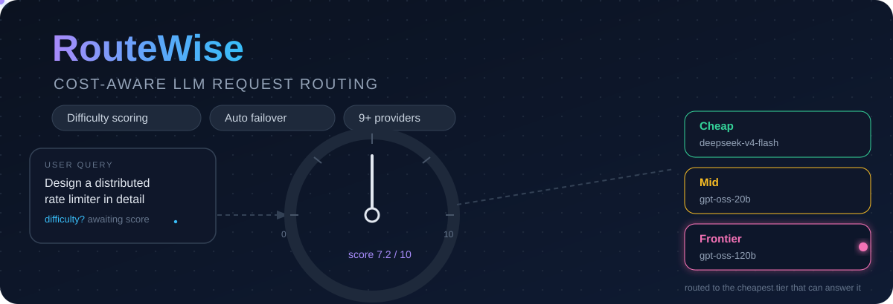
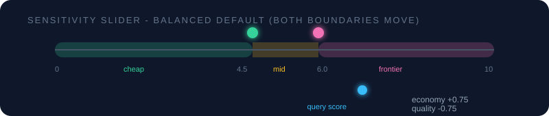
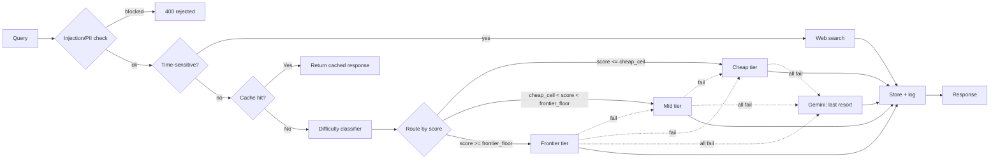
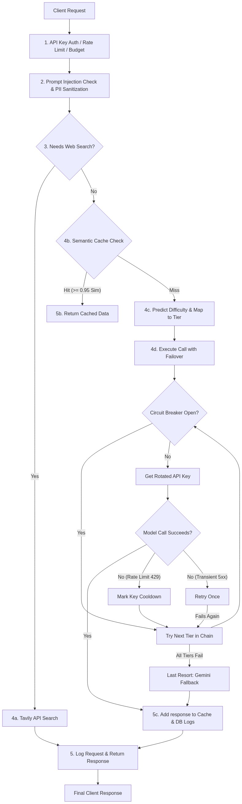
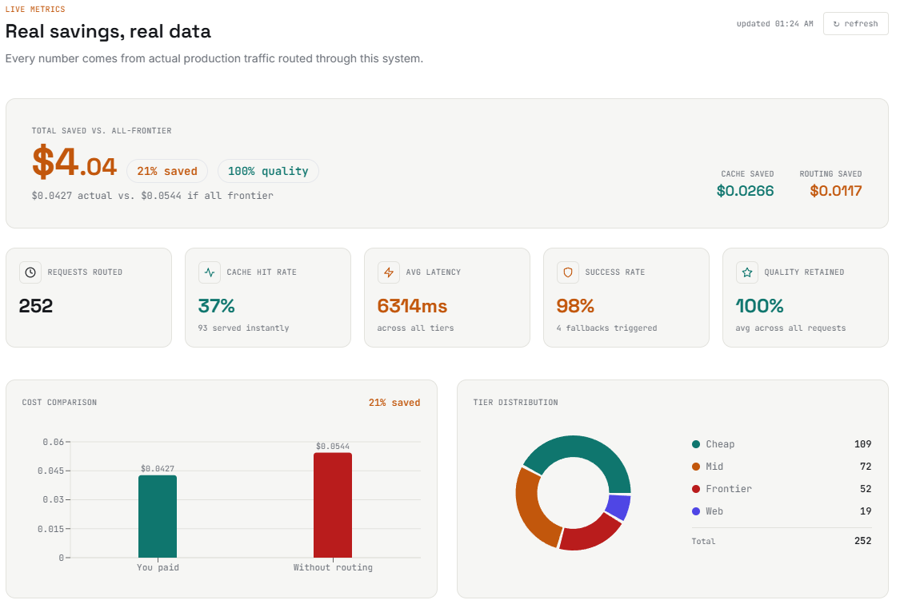
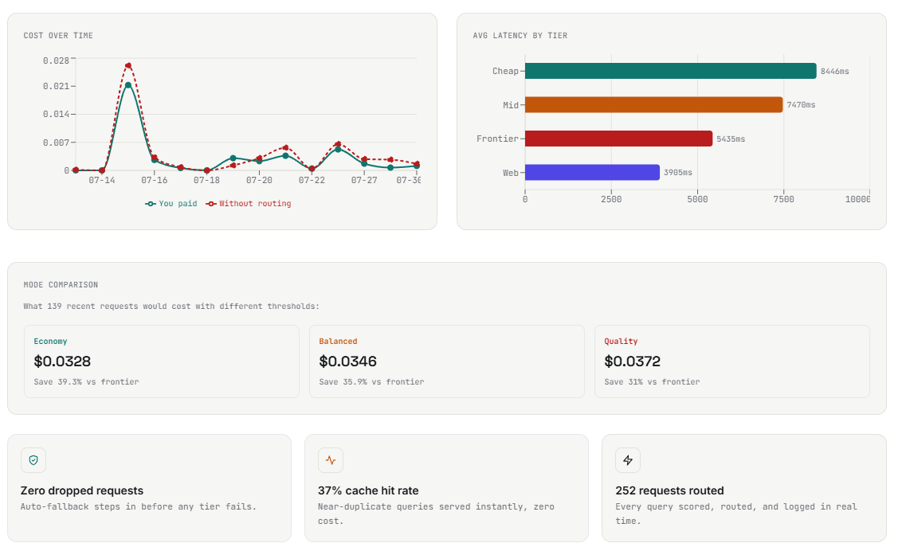
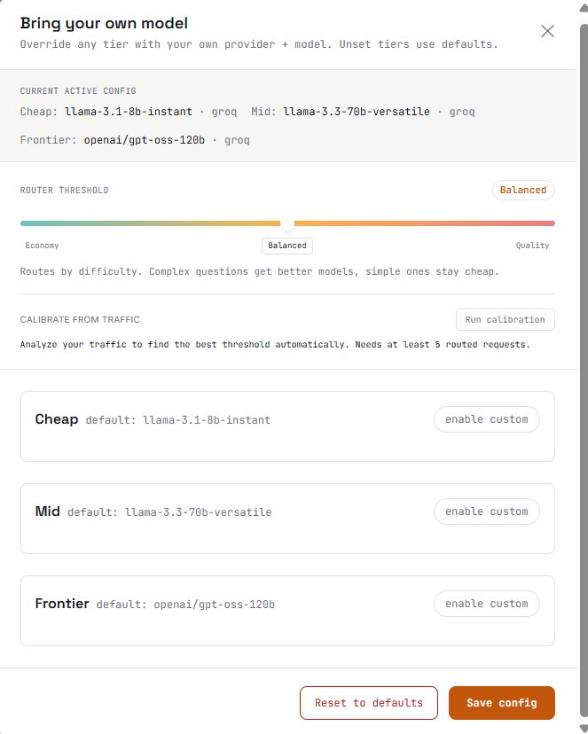

<p align="center">
  <a href="https://llm-router-nine-eta.vercel.app/"></a>
  <a href="https://pypi.org/project/routewise/"></a>
  <a href="https://www.npmjs.com/package/routewise"></a>
  <a href="https://github.com/Ishan-5/llm-router"></a>
</p>

<h1 align="center">⚡ RouteWise</h1>

<h3 align="center"><b>The cost-aware LLM request router.</b></h3>

<p align="center">
  Every query gets a <b>difficulty score</b> — then routed to the <b>cheapest model tier that can handle it</b>.<br/>
  Stop paying frontier-model prices for queries that a small model can answer perfectly.
</p>

<p align="center">
  
  
  
  
  
  
  
  
  
  
  
  <a href="https://llm-router-d2b2.onrender.com/health"></a>
</p>

<div align="center">

| 💸 **~52% cheaper** | 🎯 **77.5%** tier accuracy | ⚡ **<20 ms** per query | 🧠 **8,200** gold labels | 🔌 **9+** providers | 🧭 **3 policies** · emma · lisa · kate |
|---|---|---|---|---|---|
| than frontier-only routing | on held-out Claude-gold | local scoring, no API call | Claude-verified training set | with cross-provider failover | generic, 3-tier & 2-tier support routing |

</div>



> [!TIP]
> This banner is **live** — watch the gauge needle sweep, the packet fly, and the frontier
> node pulse. Repo READMEs support animated SVGs like this; see `screenshots/routewise-hero.svg`.

---

## 🚀 Quick start

<kbd>npm install -g routewise</kbd> &nbsp;·&nbsp; <kbd>pip install routewise</kbd>

```bash
npm install -g routewise

routewise login                 # create your key, save it without it touching shell history
routewise ask "What is the capital of France?"

Paris
[cheap score=3.11 $0.00008 · 812ms]    # routing metadata on stderr, answer clean on stdout
```

One call and the query is **scored, routed, cached, logged, and billed** — automatically.
The same routing pipeline is a Python SDK, a REST API, and an OpenAI-compatible endpoint:

```python
from routewise import RouteWiseClient

client = RouteWiseClient(api_key="rw_your_key")

# One call: scored, routed, cached, logged, billed — automatically.
result = client.ask("What is the capital of France?")
print(result["response"])     # the LLM answer
print(result["routed_to"])    # which tier handled it
print(result["cost_usd"])     # what it cost
```

> [!TIP]
> No config needed. RouteWise scores the difficulty of every query, picks the cheapest tier
> that can answer it, caches near-duplicates, and fails over across providers — out of the box.

---

## ✨ Why RouteWise?

Sending every query — `"hi"`, a summarization job, a system-design question — to the same
frontier-class model wastes money at scale. **Most queries don't need it.**

RouteWise sits between you and the LLM providers. It scores how hard each request actually is,
picks the cheapest tier that can handle it, and degrades gracefully when providers fail. You
get frontier-class quality where it matters — and **8B-model prices everywhere else**.

### RouteWise vs. calling providers directly

| | ❌ Calling a provider directly | ⚡ RouteWise |
|---|---|---|
| Difficulty-based routing | Always the same model | **Auto — cheap/mid/frontier by score** |
| Support-style queries | Fit one general classifier to tickets | **emma · lisa · kate — a policy scored and tuned per product** |
| Provider outage | Manual switching | **Auto failover + Gemini last resort** |
| Repeat queries | Billed every time | **Semantic cache → $0.00** |
| Prompt injection / PII | Your problem | **Screened before anything runs** |
| Cost tracking | Spreadsheets | **Per-request logs + dashboards + alerts** |
| Bring your own models | n/a | **Per-request `byom_config`** |
| Web search for time-sensitive queries | Manual | **Automatic Tavily routing** |
| OpenAI-compatible API | Native | **Drop-in `/v1/chat/completions`** |
| Terminal-first access | Write your own client | **`routewise` CLI, zero deps, from npm** |

> [!IMPORTANT]
> The average query costs **$0.000144** with RouteWise vs **$0.00033** if you send everything
> to the frontier model — **~52% cheaper**, before cache hits (which are free) are even counted.

---

## ✨ Features

| | | |
|---|---|---|
| 🎯 **Difficulty scoring** | 🧠 **Claude-gold trained** | 💰 **Real cost savings** |
| LightGBM ensemble scores every query 0–10 in <20 ms — locally, no API call just to decide routing | Trained on 8,200 Claude-verified labels (8,783-row gold dataset) · 77.5% exact-tier accuracy | ~52% cheaper than frontier-only; cached answers cost **$0.00** |
| 🛡️ **Guardrails first** | 🔄 **Cross-provider failover** | ⚖️ **Multi-key load balancing** |
| Prompt-injection detection + PII sanitization before anything else runs | frontier → mid → cheap → **Gemini last resort** — an outage never 503s you | Round-robin across keys per tier, per-key 429 cooldown |
| 🔌 **Bring your own model** | 🔍 **Live web search** | ⚡ **Semantic cache** |
| Any tier → any provider, incl. custom model IDs | Time-sensitive queries ("today", "latest"…) → live Tavily results | 0.95-cosine near-duplicate detection → instant, free repeats |
| 🎚️ **Sensitivity slider** | 🤖 **MCP gateway** | 🔔 **Webhook alerts** |
| Economy → Balanced → Quality moves both tier boundaries live | Agents call the full routing pipeline as a tool — no HTTP round-trip | Cost / error-rate / latency thresholds → SSRF-safe webhooks |
| 📊 **Live dashboard** | 👍 **Feedback loop** | 🧪 **OpenAI-compatible** |
| Real-time tier diagram, cost, latency, tier distribution | Thumbs up/down on every answer feeds active learning | Drop-in `/v1/chat/completions` endpoint |
| 🖥️ **Terminal-first** | ⚕️ **`routewise doctor`** | 📈 **Usage on demand** |
| `npm i -g routewise` → ask, stream, and chat right in your shell, zero runtime deps | One command walks config, backend, providers, and a live ask | `stats`, `logs`, `analytics` — no browser needed |

---

## 🧭 Meet emma, lisa & kate — three routing policies

A router that scores *every* query with one general-difficulty model is a good start. But a
support ticket is not "general chat" — a hard refund dispute and a hard coding question are
different kinds of hard. So RouteWise ships **three routing personalities**, each with its own
difficulty model and thresholds, and you switch between them **per request** across every
surface — REST, OpenAI-compatible, SDK, CLI, and the dashboard picker.

| | 🍋 **emma** · general-purpose | 💠 **lisa** · support · balanced | 🛡️ **kate** · support · max care |
|---|---|---|---|
| **Best for** | General chat, dev tools, agents | Customer support, default | Support where a miss is expensive |
| **Trained on** | 8,200 Claude-gold queries | 17,600 labeled support tickets | 17,600 labeled support tickets |
| **Difficulty model** | General | Support-scored, domain-aware | Support-scored, domain-aware |
| **Tier ladder** | cheap · mid · frontier | cheap · mid · frontier | cheap · frontier (no mid) |
| **Cutoffs** | ≤4.5 / ≥6.0 — slider-movable | ≤2.0 / ≥4.5 — fixed | ≤4.0 — fixed, single cut |
| **Frontier recall** | 58% | **80.4%** | **86.0%** |
| **Escapes** | 110 / 261 gold | 19.6% | **14.0%** |
| **Expected traffic** | ~44 / 26 / 19 | 46 / 24 / 29 | 66 / 0 / 34 |

> [!IMPORTANT]
> Scoring support queries with a model tuned on support queries is the difference between
> **58% and 86% frontier recall** on the queries that matter. And **kate** shows the real
> trade-off: drop the mid band and the ~14% of tickets that need a frontier model *get one —
> every time* — instead of 4 in 10 slipping through on generic scoring. Same embedder, same
> regressor, no extra LLM call — only the cuts change.

```python
# one router, three policies — switch per request
client.ask("What is the capital of France?")       # emma — generic routing (default)
client.ask("I want a refund", model="lisa")        # 3-tier support policy
client.ask("I was charged twice", model="kate")    # 2-tier support policy (no mid)

client.get_models()    # list all three: tiers, cutoffs, honest eval numbers
```

```bash
routewise ask "I want a refund" --model lisa   # CLI takes the same names
routewise models                               # or browse the policies
```

The OpenAI-compatible `/v1/chat/completions` endpoint accepts the names directly as
`model` (`"emma"`, `"lisa"`, `"kate"`) and routes to the right support policy automatically.
Raw REST bodies use `"support_mode": "generic" | "2tier" | "3tier"` for the exact policy id
(`2tier` = kate, `3tier` = lisa). The live demo's home screen is a picker — **Emma / Lisa /
Kate** — each with its own tier diagram, cutoff tick marks, and example prompts.

### The numbers behind lisa & kate

Both policies reuse the MiniLM embedder already resident in memory, so a support-scored
request costs **no extra embedding pass and no extra LLM call** — only the score's mapping
to a tier changes. Same 392-feature LightGBM regressor (3× L1, seeds 18/19/20, 17,600
tickets, 4 support domains), different cuts (honest eval on the shipped `.joblib`
artifacts, exposed live via `routewise models` / `GET /route/policies`):

| Policy | MAE | Spearman | Cheap recall | Mid recall | Frontier recall | Traffic share |
|---|---|---|---|---|---|---|
| **lisa · 3-tier** (≤2.0 / ≥4.5) | 0.822 | 0.786 | 79.9% | 70.9% | **80.4%** | 46 / 24 / 29 |
| **kate · 2-tier** (single cut ≤4.0) | — | — | — | — | **86.0%** | 66 / 0 / 34 |

---

## 🔄 How it works

| Step | What happens |
|---|---|
| **1 · Guard** 🛡️ | Every query is checked for **prompt-injection patterns** and **PII** before anything else. Flagged injections → `400` rejected. PII scrubbed before logging. |
| **2 · Search or Score** 🔎 | Time-sensitive queries (regex-detected: "today," "latest," "current,"…) → **live web search**. Everything else → difficulty score from a **LightGBM ensemble** (8,200 Claude-gold labels, <20 ms, no API call). |
| **3 · Route** 🎯 | Score maps to `cheap` / `mid` / `frontier` via two dynamic thresholds. A user slider moves **both** boundaries — economy sends more to cheap, quality sends more to frontier. |
| **4 · Respond** 💬 | **Semantic cache** catches near-duplicates first. If the assigned tier fails or rate-limits → step down automatically. Entire chain down → **Gemini answers as last resort**. |

### Threshold slider

| Mode | Cheap ceiling | Frontier floor | Behavior |
|---|---|---|---|
| 🪙 Economy | ≤ 5.25 | ≥ 6.75 | Max cheap, min frontier spend |
| ⚖️ Balanced | ≤ 4.5 | ≥ 6.0 | Default |
| 💎 Quality | ≤ 3.75 | ≥ 5.25 | Max frontier quality |

This slider tunes **emma** (generic routing). **lisa** and **kate** ship fixed,
support-tuned cuts (≤ 2.0 / ≥ 4.5 and ≤ 4.0) — see [the policies section](#meet-emma-lisa--kate--three-routing-policies).



---

## 🏗️ Architecture


```mermaid
flowchart LR
    Q[Query] --> G{Injection/PII check}
    G -->|blocked| X[400 rejected]
    G -->|ok| W{Time-sensitive?}
    W -->|yes| WS[Web search]
    W -->|no| C{Cache hit?}
    C -->|Yes| R[Return cached response]
    C -->|No| D[Difficulty classifier]
    D --> T{Route by score}
    T -->|score <= cheap_ceil| Cheap[Cheap tier]
    T -->|cheap_ceil < score < frontier_floor| Mid[Mid tier]
    T -->|score >= frontier_floor| Frontier[Frontier tier]
    Frontier -.fail.-> Mid
    Frontier -.fail.-> Cheap
    Mid -.fail.-> Cheap
    Cheap -.all fail.-> Gemini[Gemini: last resort]
    Mid -.all fail.-> Gemini
    Frontier -.all fail.-> Gemini
    Cheap --> S[Store + log]
    Mid --> S
    Frontier --> S
    Gemini --> S
    WS --> S
    S --> Out[Response]
```

Thresholds are dynamic — `cheap_ceil` and `frontier_floor` shift with the sensitivity slider
and are returned in every `/route` response so the frontend diagram can show live tick marks.



---

## 🧰 Tech stack

| Layer | Tools |
|---|---|
| 🧠 Difficulty model | LightGBM · sentence-transformers (MiniLM-L6-v2) |
| ⚙️ Backend | FastAPI · SQLAlchemy · Supabase Postgres · MCP gateway |
| 🔌 Providers | Groq · OpenRouter · Gemini · Ollama · Tavily · Anthropic · OpenAI · DeepSeek · Mistral · Perplexity · xAI |
| ⚖️ Load balancing | Round-robin across multiple keys per tier · per-key 429 cooldown |
| 🎨 Frontend | React · Vite · Tailwind · Recharts |
| 🚢 Deployment | Docker · Render (backend) · Vercel (frontend) · PyPI (SDK) |
| ✅ Testing | pytest (115 tests) · node:test (48 CLI) · GitHub Actions CI |

---

## 🎛️ Model tiers

| Tier | Model | $ / 1M input | $ / 1M output | $/req @ 500+500 | Backend |
|---|---|---|---|---|---|
| 🪙 Cheap | `openai/gpt-oss-20b` | $0.075 | $0.30 | $0.000188 | Groq · tries local Ollama first when enabled |
| ⚖️ Mid | `openai/gpt-oss-120b` | $0.15 | $0.60 | $0.000375 | Groq |
| 💎 Frontier | OpenRouter `deepseek/deepseek-chat` | $0.27 | $1.10 | $0.000685 | OpenRouter |
| 🔎 Web | live search results | — | — | — | Tavily (time-sensitive only) |

Prices must ascend cheap < mid < frontier. They previously did not: `deepseek-chat` sat in
**cheap** at $0.28/$1.10 while `gpt-oss-120b` sat in **frontier** at $0.15/$0.60, so every
downroute to cheap spent 1.84x *more* than calling frontier and the savings claims inverted.
`deepseek-chat` is the most expensive of the three, so it now sits on the top rung.

**Last-resort fallback:** `gemini-3.6-flash` via Google — a genuinely independent provider, not
just another Groq tier.

---

## 💰 The cost math

~1,000 input + ~300 output tokens per query, balanced sensitivity:

| | Frontier-only baseline | RouteWise routed |
|---|---|---|
| Cheap share (~50%) | — | `gpt-oss-20b` @ $0.075/$0.30 → **$0.000165** |
| Mid share (~35%) | — | `gpt-oss-120b` @ $0.15/$0.60 → **$0.000330** |
| Frontier share (~15%) | `deepseek-chat` @ $0.27/$1.10 → **$0.000600** | `deepseek-chat` @ $0.27/$1.10 → **$0.000600** |
| **1,000 queries** | **$0.600** | **$0.288** |

> [!NOTE]
> **≈ 52% cheaper** than sending everything to the frontier model, on the tier mix above.
> The figure moves with the tier mix, the token counts, and which model you treat as
> frontier — the [savings calculator](/calculator) lets a visitor set all three.
> Semantic-cache hits add further savings — cached answers cost **$0** in tokens.

> [!WARNING]
> The landing page advertises a flat **~40%**, not this number. 40% is the
> conservative figure we hold across real traffic mixes; the 52% above is only
> true for the specific mix and token counts in that table.

---

## 📊 Measured results

Snapshot from the running deployment (`GET /stats`), over roughly 310 routed requests:

| Metric | Value |
|---|---|
| Requests routed | ~310 |
| Tier split | 44% cheap · 26% mid · 19% frontier · 9% web · 2% failed |
| Semantic cache hit rate | 34% |
| Total spend on that traffic shown | ~$0.05 |

The tier distribution shows the router doing what it's built for — the majority of queries
are easy enough for the cheap model, and only the genuinely hard ones reach the frontier
tier. Blended cost was ~$0.00015 per request against ~$0.00033 for sending all of it to
the frontier model.

---

## 🎯 Model accuracy

Head-to-head on the **same 783 held-out Claude-gold rows** (queries neither model ever trained
on), each model at its balanced slider thresholds:

| Metric | v15 (previous) | 🚀 v20 (deployed) |
|---|---|---|
| MAE | 1.069 | **1.018** |
| Spearman rank correlation | 0.850 | **0.861** |
| Exact-tier accuracy | 70.6% | **77.5%** |
| Cheap recall | 88% | **94%** |
| Mid recall | 68% | 40% |
| Frontier recall | 41% | **58%** |
| Under-routed frontier queries (of 261 gold) | 154 | **110** |
| Gold training labels | 1,703 | **8,200** |
| Balanced thresholds | 4.0 / 6.0 | 4.5 / 6.0 |
| Per-call scoring latency | ~12 ms | ~16.5 ms |

The 5× jump in Claude-verified training labels (1,703 → 8,200) bought a deliberate shift — the
model is now more decisive at both boundaries. It catches far more under-routed hard queries
(frontier recall 41% → 58%, under-routed cut from 154 → 110 — the failure mode that actually
costs money when a hard query lands on the cheap model) and sends easy queries to the cheap
tier more reliably (cheap recall 88% → 94%). The tradeoff is a thinner mid band (mid recall 68%
→ 40%): a gold-mid query is now more likely to be pushed up to frontier or down to cheap than
called mid. Overall exact-tier accuracy still improves 70.6% → 77.5%.

---

## 🔌 Bring your own model (BYOM)

Not locked into the defaults. Every tier can be pointed at **any provider or model you already
pay for** — including custom model IDs no catalog could anticipate.

- **Per request** — works for any caller, even plain curl. Pass `byom_config` (provider + model
  per tier) and `user_api_keys` in the `/route` body. The SDK does this automatically:

```python
client.configure(
    cheap={"provider": "openrouter", "model_id": "deepseek/deepseek-v4-flash", "api_key": "sk-or-v1-..."},
    frontier={"provider": "openai", "model_id": "gpt-4o", "api_key": "sk-..."},
)
result = client.ask("Design a distributed rate limiter")  # keys attached automatically
```

- **Saved config** — signed-in users persist it once with `POST /config`. **Keys are never
  stored**, only provider/model selections.

- **Costed at the model's real rate** — an overridden tier is repriced against the model you
  actually selected, matched on provider *and* model in the `model_pricing` table, so cost and
  savings are never computed with the tier default's rates. For a model outside the catalog,
  include its rates in the same block:

```json
"byom_config": {
  "cheap": {
    "provider": "openai", "model_id": "my-fine-tune",
    "price_per_m_input": 1.5, "price_per_m_output": 6.0
  }
}
```

### Supported providers

| Provider | In the box |
|---|---|
| **Groq** · **OpenAI** · **Anthropic** | ✅ ✅ ✅ |
| **OpenRouter** · **Gemini** · **DeepSeek** | ✅ ✅ ✅ |
| **Mistral** · **Perplexity** · **xAI** | ✅ ✅ ✅ |
| **Ollama** | ✅ |
| **Custom model IDs** | ✅ |

The dashboard populates its tier dropdowns directly from `/providers`.

---

## 🔒 Security

- 🛡️ **Prompt-injection detection** — checked against known patterns before classification;
  matches are rejected with a 400, not silently routed.
- 🔏 **PII sanitization** — detected PII is scrubbed before a query is written to logs.
- 🔑 **API keys are never stored** — BYOM stores provider/model *selections* only; user keys
  are used per-request and never persisted.
- 🚦 **Per-key auth, rate limiting, and budget caps** on `/route` and `/logs`, with logs
  filtered to the calling key only.
- 🌐 **SSRF-safe webhook validation** — must be `https://`, non-localhost, non-private-IP
  (blocks 10.x, 172.16.x, 192.168.x, 169.254.x, loopback, link-local).
- 🔒 **CORS restricted** to the deployed frontend origin and localhost — not wildcard.

---

## ⚙️ Engineering decisions

- **Continuous score, not fixed categories.** The difficulty model outputs a float (practical
  range ~0–9; theoretical 0–10). Routing thresholds can be retuned **without relabeling data**.
- **Training data mirrors real traffic.** The 7,488-query labeled pool is right-skewed toward
  easy-to-moderate queries (mean 3.5/10, median 3, 27% ≥5, 15% ≥7) — the distribution routing
  is built for. The sparse expert tail (8–10, ~14%) is where under-confidence shows up, noted
  under [Known limitations](#known-limitations).
- **Both boundaries move with the slider.** Economy raises both (more cheap); quality lowers
  both (more frontier). Balanced = cheap ≤ 4.5 / frontier ≥ 6.0, sliding ±0.75 per step.
- **`score_to_tier` returns `(tier, cheap_ceil, frontier_floor)`** so the `/route` response can
  render live tick marks in the frontend diagram — no extra API call.
- **Cache threshold is conservative (0.95 cosine similarity) on purpose.** *"convert 5 miles to
  km"* and *"convert 10 miles to km"* are ~95%+ similar in embedding space with different
  answers. Fewer cache hits beats a wrong cached answer.
- **Cheap-tier fallback lives inside the provider call, not the tier chain.** If local Ollama
  fails, the OpenRouter cheap model serves the request — transparently, still logged as tier `cheap`.
- **Gemini is a last resort, not a routing tier** — genuinely different infrastructure, so a
  Groq-wide outage doesn't take the router down.
- **Cache similarity search is vectorized** — one matrix operation, not N per-row loops.
- **Multi-key balancing uses per-key cooldown, not pool-level** — one 429 skips one key for 30s;
  the rest of the pool keeps serving.
- **Alert cooldown is per-rule, not global** — a cost alert and a latency alert fire
  independently.

---

## ⚠️ Known limitations

- 🔐 **BYOM is scoped per user, not per-API-key.** Config loads per user
  (`get_active_config(user_id)`), so two keys of the same user share config; script-created
  keys without a `user_id` share the global config.
- 🧮 **The difficulty model is weakest on short, jargon-heavy math/physics one-liners** — few
  of those in the training pool, so it leans on sparse lexical cues. System-design error is now
  mid-pack after the 300-query frontier expansion.
- 🏷️ **Training labels are Claude-verified, not human-audited.** Every label in the 7,488-query
  pool was re-scored by Claude (8B auto-labels over-scored ~1.4 on average), plus a 300-query
  frontier expansion → 8,783 total gold rows. Current model: MAE 1.018, Spearman 0.861, 77.5%
  exact-tier accuracy.
- 🛡️ **Injection/PII detection is regex-based**, not a trained classifier — catches known
  patterns, not a guarantee against novel attacks.
- 📦 **Rate limiting is in-memory** — correct for one instance; would need Redis for a
  distributed deployment.
- ⏰ **Alert cooldown is DB-backed, but the check loop runs per-process.** Fine for a single
  instance; a small race window exists if two processes check the same rule before either
  commits.
- 🤖 **MCP server has no auth.** Local stdio process only — don't expose it as a network
  service without adding auth.

---

## 📦 SDK

Published on [PyPI](https://pypi.org/project/routewise/):

```bash
pip install routewise
```

```python
from routewise import RouteWiseClient, AuthError, AllTiersFailedError

client = RouteWiseClient(api_key="rw_your_key")

# Auto-route, force a tier, or override keys per request
client.ask("query")
client.ask("query", override_tier="frontier")
client.ask("query", user_api_keys={"frontier": "sk-..."})

# Pick a policy: emma (generic, default) · lisa (3-tier) · kate (2-tier)
client.ask("I want a refund", model="lisa")
client.ask("I was charged twice", model="kate")
client.get_models()     # every policy: tiers, cutoffs, honest eval numbers

# BYOM config (client-side, keys never stored)
client.configure(cheap={...}, mid={...}, frontier={...})
client.get_config()     # active config, no keys returned
client.get_providers()  # all supported providers + models
client.reset()

# Stats
client.stats()          # requests, cost saved, tier distribution
```

---

## 🖥️ Terminal CLI

Same router, your terminal. Installed and updated straight from npm with zero runtime
dependencies, talking to the identical hosted backend as the SDK:

```bash
npm install -g routewise

routewise login                                        # create + save your key (hidden paste)
routewise ask "what is the capital of france"           # one query, answered instantly
routewise ask "design a rate limiter" --tier frontier   # force a tier, or --threshold 0|1|2
routewise ask "i want a refund" --model lisa            # pick a policy: emma (default) · lisa · kate
routewise stream "write a haiku about routing"          # tokens as they arrive
routewise chat                                          # multi-turn REPL
```

Answers print to **stdout**; routing metadata — tier, difficulty score, cost, latency,
cache hit — prints to **stderr**, so `routewise ask "$Q" --json | jq -r .response` and
`routewise ask "$Q" > out.txt` pipeline like any Unix tool.

Replies arrive as Markdown and are **re-rendered for the terminal**: bold headings, `•`
lists, `☐`/`☑` checklists, aligned tables, quotes, and code blocks. Piped output gets the
markup stripped with **zero ANSI codes** (`--no-color` / `NO_COLOR` forces plain text).

| Command | What it does |
|---|---|
| `login` / `whoami` | Create + save a key via masked paste / verify identity, spend & cache rate |
| `ask` / `stream` / `chat` | Route a query · stream tokens as they arrive · multi-turn conversation |
| `models` | List the three policies (emma · lisa · kate) with tiers, cutoffs & evals |
| `stats` / `logs` / `analytics` | Usage, cost, savings, request log lines, cost analytics |
| `byom` | Bring your own model per tier — set once, auto-attached to every call |
| `doctor` | End-to-end self-check: config → backend → providers → live ask |
| `evaluate "<q>"` | Difficulty score + routing per mode (works without a key) |
| `pricing` / `providers` / `config` | Model price list · provider catalog · effective config |

Keys never enter shell history (`login` masks the paste), and BYOM keys live only in your
local config file — never on the server. Full command reference: [cli/README](./cli/README.md).

---

## 🤖 MCP gateway

RouteWise ships an MCP server (`router/mcp_server.py`) that exposes the full routing pipeline
as a tool agents can call directly — no HTTP round-trip.

```bash
pip install mcp
cd llm-router/backend
python -m router.mcp_server
```

**Claude Desktop** (`~/.claude/claude_desktop_config.json`):

```json
{
  "mcpServers": {
    "routewise": {
      "command": "python",
      "args": ["-m", "router.mcp_server"],
      "cwd": "/path/to/llm-router/backend"
    }
  }
}
```

The tool is `ask_routewise(query, override_tier?, threshold?)` — runs guardrails → web search →
cache → classifier → failover, same as `/route`. Responses are prefixed with routing metadata:
`[cheap score=2.31 $0.00001]`.

---

## 🔔 Alerting

Webhook alerts on **cost**, **error rate**, or **latency** thresholds — via dashboard or API.
Alerts fire at most once per hour per rule.

```bash
# Create an alert
curl -X POST https://your-backend/alerts \
  -H "Authorization: Bearer <supabase-jwt>" \
  -d '{"alert_type": "daily_spend", "threshold": 0.10, "webhook_url": "https://hooks.example.com/..."}'
```

Webhook payload:

```json
{
  "alert_type": "daily_spend",
  "threshold": 0.10,
  "current_value": 0.143,
  "message": "Daily spend $0.1430 exceeded threshold $0.1000"
}
```

| Alert type | Trigger |
|---|---|
| `daily_spend` | today's spend ≥ threshold (USD) |
| `error_rate` | failed requests in last hour ≥ threshold (%) |
| `latency` | avg latency in last hour ≥ threshold (ms) |

---

## ❓ FAQ

<details>
<summary><b>Do I need Python to use RouteWise?</b></summary>

No. `npm install -g routewise` gives you the whole router in your terminal, against the same
hosted backend — no Python required. Python is only needed if you want to run the backend and
Ollama locally.

</details>

<details>
<summary><b>Do I need an account to use the router?</b></summary>

No. A `rw_` API key — created in one command via `scripts/create_api_key.py` or through the
dashboard — unlocks `/route`, logs, and stats. A signed-in account adds per-user settings,
saved BYOM configs, and webhook alerts.

</details>

<details>
<summary><b>What happens if Groq is down?</b></summary>

Requests fail over tier-to-tier automatically (frontier → mid → cheap), the circuit breaker
trips for 60 s and skips the failing tier, and if *every* Groq/Ollama tier fails, an
independent provider (Gemini) answers as a last resort rather than returning a 503.

</details>

<details>
<summary><b>How accurate is the difficulty classifier?</b></summary>

MAE 1.018, Spearman 0.861, 77.5% exact-tier accuracy at balanced thresholds on held-out data.
Trained on a 7,488-query pool where every label is Claude-gold, plus 712 gold-only extras — an
8,200-row training set drawn from an 8,783-row Claude-verified gold dataset. Scoring runs
locally in <20 ms — no API call just to decide routing. Full comparison: [Model accuracy](#model-accuracy).

</details>

<details>
<summary><b>Which routing policy should I use — emma, lisa, or kate?</b></summary>

**emma** is the default: general-difficulty routing, thresholds movable with the slider.
For customer-support traffic, switch to **lisa** (3-tier, support-scored) — or **kate**
(2-tier) when the cost of a hard ticket slipping through outweighs the extra frontier spend.
Pick per request: `client.ask(..., model="lisa")`, `routewise ask "..." --model lisa`, or
`model="lisa"` on the OpenAI-compatible endpoint. See the
[three-policies section](#meet-emma-lisa--kate--three-routing-policies).

</details>

<details>
<summary><b>Can I use my own models?</b></summary>

Yes — BYOM works per-request for any caller, or as a saved config for signed-in users, spanning
Groq, OpenRouter, OpenAI, Anthropic, Gemini, DeepSeek, Mistral, Perplexity, xAI, Ollama, and
custom model IDs.

</details>

<details>
<summary><b>What happens to my queries and keys?</b></summary>

Queries are logged with PII scrubbed before writing; keys are never persisted — BYOM configs
store only provider/model selections, and user-supplied keys are attached per request and
dropped after.

</details>

---

## 🧪 Running it locally

```bash
git clone https://github.com/Ishan-5/llm-router.git
cd llm-router/backend

pip install -r ../requirements.txt
uvicorn router.main:app --reload

# frontend, separate terminal
cd ../frontend
npm install
npm run dev
```

Needs a `.env` with `OPENROUTER_API_KEY`, `GROQ_API_KEY`, `GEMINI_API_KEY`, `TAVILY_API_KEY`,
`DATABASE_URL` (Supabase Postgres), `SUPABASE_URL`, and `SUPABASE_SERVICE_KEY`. Ollama is
optional — if it's not running, the cheap tier uses OpenRouter automatically.

Optional multi-key load balancing:

```bash
GROQ_KEYS_CHEAP=gsk_a,gsk_b,gsk_c
GROQ_KEYS_MID=gsk_d,gsk_e
GROQ_KEYS_FRONTIER=gsk_f,gsk_g
```

## 🐳 Running it with Docker

```bash
docker compose build
docker compose up
```

Ollama still runs natively on the host, not in the container — see `docker-compose.yml` for the
`host.docker.internal` networking that lets the container reach it.

---

## 📸 Screenshots







---

## 🗂️ Project structure

<details>
<summary><b>Click to expand</b></summary>

```
llm-router/
├── backend/
│   ├── router/
│   │   ├── main.py               # FastAPI app, mounts all routers, alert loop, /health, /metrics
│   │   ├── routes/
│   │   │   ├── route.py          # /route, /route/stream (SSE token streaming), /route/feedback
│   │   │   ├── keys.py           # /keys CRUD
│   │   │   ├── config.py         # /config, /pricing, /providers
│   │   │   ├── stats.py          # /stats, /logs, /analytics, /calibrate, /compare, /evaluate
│   │   │   ├── alerts.py         # /alerts CRUD
│   │   │   ├── settings.py       # /settings
│   │   │   ├── admin.py          # /admin/* (incl. outage simulator)
│   │   │   ├── demo.py           # presentation outage-mode controls
│   │   │   └── news.py           # time-sensitive queries → live news/web results
│   │   ├── classifier.py         # get_tier() — wraps predict_difficulty + score_to_tier
│   │   ├── providers.py          # call_model(), call_gemini(), stream_model()
│   │   ├── providers_registry.py # all supported providers + model lists
│   │   ├── rate_limiter.py       # call_with_failover(), stream_model_with_failover(), AllTiersFailedError
│   │   ├── circuit_breaker.py    # per-tier circuit breaker (CLOSED/OPEN/HALF)
│   │   ├── load_balancer.py      # multi-key round-robin with 429 cooldown
│   │   ├── cache.py              # semantic cache (cosine similarity, vectorized)
│   │   ├── guardrails.py         # injection detection, PII sanitization, web search detection
│   │   ├── auth.py               # API key auth, JWT, budget enforcement
│   │   ├── db.py                 # SQLAlchemy models: ApiKey, RequestLog, UserConfig, AlertRule, ...
│   │   ├── openai_compat.py      # /v1/chat/completions drop-in (SSE streaming included)
│   │   ├── mcp_server.py         # MCP stdio server — ask_routewise tool
│   │   ├── model_config_loader.py# per-user merged tier config (BYOM overrides on defaults)
│   │   ├── quality_judge.py      # post-hoc response quality scoring (feedback loop)
│   │   ├── difficulty_labeler.py # LLM-assisted difficulty labeling for training data
│   │   ├── ollama_client.py
│   │   └── config.py             # MODEL_CONFIG, FALLBACK_CHAIN, env vars
│   ├── src/
│   │   ├── predict_difficulty.py # LightGBM inference + score_to_tier()
│   │   └── train_difficulty_model.py
│   ├── models/
│   │   ├── difficulty_regressor.joblib
│   │   └── minilm/               # MiniLM-L6-v2 weights (local, no download at runtime)
│   ├── tests/
│   │   ├── conftest.py           # shared fixtures
│   │   ├── test_tier_logic.py
│   │   ├── test_cache_similarity.py
│   │   ├── test_auth.py
│   │   ├── test_rate_limiter.py  # incl. stream_model_with_failover live tier tests
│   │   ├── test_route_integration.py
│   │   └── test_openai_compat.py # /v1 streaming + cache/web SSE tests
│   └── scripts/
│       ├── create_api_key.py
│       ├── load_test_requests.py
│       ├── export_labeled_queries.py
│       └── load_test_pricing.sql
│
├── frontend/
│   ├── src/
│   │   ├── components/           # QueryForm, RoutingDiagram, TierCircuit, DashboardPage,
│   │   │                         #   OnboardingWizard, ApiPlayground, ResponseCard, ... (~30)
│   │   ├── api.js                # REST + SSE streaming client (routeQueryStream)
│   │   ├── App.jsx
│   │   └── config.js
│   ├── package.json
│   └── vite.config.js
│
├── cli/
│   ├── src/                  # routewise npm CLI: ask, stream, chat, stats, byom, doctor, login
│   └── package.json
│
├── sdk/
│   ├── routewise/                # PyPI package
│   └── setup.py
│
├── docker-compose.yml
├── Dockerfile
└── requirements.txt
```

</details>

---

## 🗺️ Roadmap

| Status | Item |
|---|---|
| 🔜 | ML-based PII/injection classifier (regex-only today) |
| 🔜 | Per-key BYOM isolation (config is per-user today) |
| 🔜 | Distributed rate limiting (in-memory today → Redis for multi-instance) |
| 🔜 | MCP server auth (fine for local use, not network exposure) |

*Not needed to call the current version complete — documented here for transparency.*

---

<p align="center">
  Built by <b><a href="https://github.com/Ishan-5">Devansh Kumar Pandey (Ishan)</a></b> · <a href="https://linkedin.com/in/devansh584">LinkedIn</a>
</p>

<p align="center">
  <a href="https://llm-router-nine-eta.vercel.app/"></a>
  <a href="https://pypi.org/project/routewise/"></a>
  <a href="https://www.npmjs.com/package/routewise"></a>
  <a href="https://github.com/Ishan-5/llm-router"></a>
</p>
